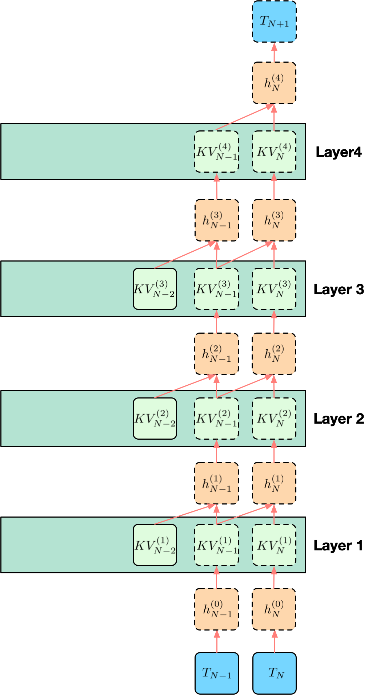

# SWA KV Cache 存储方案

## 1. 问题定义

设已命中的前缀长度为 $N$，现在模型要根据前缀最后一个位置预测下一个 token，即 $\text{token}_{N+1}$。模型共有 $L$ 层，并采用 sliding window attention（SWA）。这里约定窗口大小 $W$ 包含当前参与计算的位置本身。因此在位置 $N$ 计算用于预测 $\text{token}_{N+1}$ 的表示时，第 $\ell$ 层访问的窗口范围为

$$
\mathcal{W}_N = \{N-W+1,\dots,N\}
$$

若 $N < W$，则窗口退化为 $\{1,\dots,N\}$。记：

- 第 $\ell$ 层、位置 $t$ 的输出 hidden state 为 $h_t^{(\ell)}$，其中 $h_t^{(0)}$ 表示输入 token embedding
- 第 $\ell$ 层、位置 $t$ 的 key/value 状态记为 $KV_t^{(\ell)}$，其中包含 $K_t^{(\ell)}$ 和 $V_t^{(\ell)}$

位置 $N$ 的最后一层输出表示为 $h_N^{(L)}$，它经过 LM head 后用于预测 $\text{token}_{N+1}$。为了得到 $h_N^{(L)}$，模型需要从第 1 层计算到第 $L$ 层。对任意一层 $\ell$，位置 $N$ 的计算需要两类信息：

1. **当前 token 在这一层的输入**，即 $h_N^{(\ell-1)}$

2. **SWA 窗口内的历史 attention 状态**，即 $(KV_t^{(\ell)})_{t \in \mathcal{W}_N}$

下面将以一个 $L=4$, $W=2$ 的例子来说明各个方案的存储与计算。

## 2. 完全保存 SWA KV Cache Baseline

最直接的做法是：对每一层 $\ell = 1,\dots,L$，保存所有可能进入 SWA 窗口的 full K/V。预测 $\text{token}_{N+1}$ 时的执行路径为：

1. 从底向上计算位置 $N$ 的表示，得到 $h_N^{(0)}, h_N^{(1)}, \dots$
2. 到达第 $\ell$ 层时，用 $h_N^{(\ell-1)}$ 生成当前位置的 query
3. 读取第 $\ell$ 层窗口内缓存的 full K/V：$(KV_t^{(\ell)})_{t \in \mathcal{W}_N}$
4. 完成该层 attention 和后续子层，得到 $h_N^{(\ell)}$
5. 重复直到第 $L$ 层，得到 $h_N^{(L)}$

### 示例

  

图中的例子取 $L=4, W=2$，因此位置 $N$ 在每一层只访问窗口 $\mathcal{W}_N=\{N-1,N\}$。绿色块表示已经保存好的 full KV，橙色块表示当前位置 $N$ 沿层向上计算得到的 hidden state。虚线框表示当前 decode step 需要计算的，实线框表示已经缓存并可直接读取的。

以第 4 层为例，$h_N^{(4)}$ 的计算读取 $KV_{N-1}^{(4)}$ 和 $KV_N^{(4)}$。系统不需要重新计算 $h_{N-1}^{(3)}$，因为位置 $N-1$ 在第 4 层需要贡献给 attention 的状态已经保存在 $KV_{N-1}^{(4)}$ 中。其它层同理：当前位置的 hidden state 逐层向上计算，窗口内历史 token 的影响通过各层已缓存的 full KV 进入 attention。

### 开销

#### DRAM 存储开销
若前缀命中长度为 $N$，full KV baseline 需要为命中前缀保存完整 K/V。其状态规模近似为：

$$
B_{\text{full}}(N) \approx N \cdot L \cdot 2 \cdot H_{kv} \cdot D \cdot s
$$

其中 $H_{kv}$ 为每层 KV 头数，$D$ 为 head dim，$s$ 为每个元素字节数。公式中的系数 $2$ 来自 K 和 V 两个张量。

#### HBM 搬运开销

SWA 只限制当前 step 的 attention 读取范围；若只看第 $N$ 个位置实际参与 attention 的窗口工作集，规模为：

$$
B_{\text{swa}}(W) \approx W \cdot L \cdot 2 \cdot H_{kv} \cdot D \cdot s
$$

如果命中后的 full KV 已经在 GPU KV cache 中，当前 step 的主要数据读取就是窗口内的 $B_{\text{swa}}(W)$。

#### 计算开销

窗口内 $KV_t^{(\ell)}$ 已经是 attention 可消费的终态，当前 step 不需要恢复历史 KV。因此，full KV baseline 的额外恢复计算可以近似看作 0。

但 baseline 仍然要完成当前位置 $N$ 的正常 decode 计算。按 token-layer 计数，当前位置 hidden state 需要逐层向上计算：

$$
N_{\text{hidden}}^{\text{full}} = L
$$

attention 侧，每一层读取窗口内 $W$ 个位置的 KV，因此逻辑 attention 访问规模为：

$$
N_{\text{attn-read}}^{\text{full}} \approx L \cdot W
$$

以 DeepSeek V4 Pro 的量级估算，若取 $L=61,W=128$，full KV baseline 在一次 decode step 中，当前位置 hidden state 的逐层计算量为：

$$
N_{\text{hidden}}^{\text{full}} = 61
$$

attention 侧每层读取窗口内 $W$ 个位置的 KV，逻辑 attention 访问规模为：

$$
N_{\text{attn-read}}^{\text{full}} \approx 61 \times 128 = 7808
$$

## 3. 完全重算 Baseline

另一个极端方案是只保留前缀内容本身，不为命中前缀长期保存可直接使用的 K/V。prefix hit 表示系统知道这段 token 序列已经出现过；当前 step 需要窗口 $\mathcal{W}_N$ 的 K/V 时，系统从 token 和已有边界状态重新生成这些状态。

预测 $\text{token}_{N+1}$ 时，每一层最终仍然只需要窗口内状态：

$$
(KV_t^{(\ell)})_{t \in \mathcal{W}_N}
$$

为了得到第 $\ell$ 层、窗口内位置 $t$ 的 $KV_t^{(\ell)}$，系统需要先得到该位置上一层的 hidden state $h_t^{(\ell-1)}$。而 $h_t^{(\ell-1)}$ 又依赖更低层对位置 $t$ 的 SWA 窗口计算。完全重算因此会形成一个向低层、向更早 token 扩张的依赖锥。

### 示例

  

仍取 $L=4, W=2$。为了计算 $h_N^{(4)}$，第 4 层需要第 3 层窗口内的 hidden states，即位置 $\{N-1,N\}$。继续向低层展开。这正对应图里的依赖锥：虽然每一层 SWA 只看 2 个位置，但为了从零恢复最高层当前位置的输出，底部输入范围会扩展到 5 个 token。

### 开销

#### DRAM 存储开销

完全重算 baseline 不长期保存可直接读取的 full KV。若只保留原始 token 和最小 metadata，KV 存储可以近似看作 0。这个方案把 DRAM/cache tier 的 KV 存储压力压到最低。

#### HBM 搬运开销

prefix hit 后不需要搬运 full KV。系统需要把原始 token、必要 metadata 和重算所需的中间结果送入当前计算路径。相比 full KV baseline，它减少了 KV load，但无法避免后续重算产生的 HBM 读写。

#### 计算开销

可以用一个递推集合描述这个依赖锥。令 $R_\ell$ 表示重算过程中需要得到第 $\ell$ 层 hidden state 的位置集合。为了得到最终输出，最高层只需要当前位置：

$$
R_L = \{N\}
$$

若第 $\ell$ 层需要计算集合 $R_\ell$ 中的位置，那么第 $\ell-1$ 层必须提供这些位置各自 SWA 窗口内的 hidden states：

$$
R_{\ell-1} = \bigcup_{t \in R_\ell} \{t-W+1,\dots,t\}
$$

当这些集合都是连续区间时，集合长度会逐层向低层扩张。忽略序列起点截断时，有：

$$
|R_\ell| \approx 1 + (L-\ell)(W-1)
$$

因此，完全重算需要处理的 token-layer 单元数近似为：

$$
N_{\text{hidden}} \approx \sum_{\ell=1}^{L} |R_\ell| \approx L + \frac{L(L-1)}{2}(W-1)
$$

这里统计的是需要重算的 hidden states，不包含输入 token 覆盖范围。若把输入 token 也算进去，覆盖长度近似为：

$$
|R_0| \approx 1 + L(W-1)
$$

需要恢复的 KV 由对应位置的 hidden states 派生得到，下面不再单独统计这部分 token-layer 数。

以 DeepSeek V4 Pro 的量级做一个估算，若取 $L=61$、$W=128$，则输入 token 覆盖范围约为：

$$
1 + L(W-1) = 1 + 61 \times 127 = 7748
$$

也就是说，在没有中间 checkpoint 截断依赖的情况下，单次恢复可能向前扩展到约 $7.7K$ 个输入 token 的范围。累计 hidden-state 重算量为：

$$
L + \frac{L(L-1)}{2}(W-1) = 61 + \frac{61 \times 60}{2} \times 127 = 232471
$$

## 4. 保存浅层 KV 的恢复成本

另一种做法是只长期保存浅层 full KV。设保存的层为 $1,\dots,m$，未保存的层为 $m+1,\dots,L$。预测 $\text{token}_{N+1}$ 时，浅层 KV 可以直接服务这些层的 SWA attention；高层 KV 缺失，需要在当前 step 从浅层输出继续恢复。

执行路径可以写成：

1. 为高层缺失段确定需要恢复的窗口位置集合
2. 将这些位置从输入侧推到第 $m$ 层，得到 $(h_t^{(m)})_{t\in R_m}$
3. 用这些第 $m$ 层 hidden states 继续恢复第 $m+1,\dots,L$ 层的窗口状态
4. 逐层得到最终的 $h_N^{(L)}$，并预测 $\text{token}_{N+1}$

这个路径的特点是：浅层 KV 已经保存，但系统仍然要把多个 token 位置推过浅层，给高层窗口状态恢复提供输入。

### 示例

  

图中例子取 $L=4, W=2, m=2$。第 1、2 层的 KV 已经保存，第 3、4 层的 KV 需要恢复。为了得到最终的 $h_N^{(4)}$，第 4 层需要窗口内 $KV_{N-1}^{(4)},KV_N^{(4)}$；这些 KV 又需要第 3 层对应位置的 hidden states。因此第 3 层要恢复位置 $\{N-1,N\}$，第 2 层需要提供位置 $\{N-2,N-1,N\}$ 的 hidden states。浅层 KV 虽然已经保存，但系统仍然要把这 3 个位置从输入侧推到第 2 层，形成一个浅层矩形带。

在 $L=4,W=2,m=2$ 的例子里，未保存高层数为 $q=L-m=2$。第 2 层需要提供的位置数为：

$$
|R_2| = 1 + 2 \times 1 = 3
$$

浅层矩形带需要计算 $2 \times 3=6$ 个 hidden-state 单元；高层依赖锥需要计算 $|R_3|+|R_4|=2+1=3$ 个 hidden-state 单元。这与图中的形状一致：第 1、2 层是宽度为 3 的矩形带，第 3、4 层继续向上收缩。

### 开销

#### DRAM 存储开销

保存浅层 $1,\dots,m$ 的 full KV 时，前缀长度为 $N$ 的常驻状态规模近似为：

$$
B_{\text{shallow}}(N,m) \approx N \cdot m \cdot 2 \cdot H_{kv} \cdot D \cdot s
$$

它是 full KV baseline 的 $m/L$。存储量下降来自不保存高层 KV；代价是高层窗口状态要在命中后恢复。

#### HBM 搬运开销

浅层 KV 已经保存，恢复 $R_m$ 中多个位置时，每个浅层 token-layer 单元都要读取对应层的 SWA 窗口 KV。若按逻辑 attention 读取量估算，浅层读取规模近似为：

$$
B_{\text{low-read}} \approx m \cdot |R_m| \cdot W \cdot 2 \cdot H_{kv} \cdot D \cdot s
$$

相邻窗口之间存在重叠，实际 kernel 的 HBM 访问会受 layout、cache 命中和 batching 影响。这个式子更适合作为上界口径，表示浅层矩形带会把同一批浅层 KV 反复用于多个位置的恢复计算。

#### 计算开销

保存浅层 KV 的主要计算压力来自两部分：一是浅层矩形带，需要把 $|R_m|$ 个位置逐层推到分界层 $m$；二是高层缺失段，需要生成窗口内高层 KV 并继续向上恢复。和保存高层 KV 相比，这条路线没有直接保存当前 step 最靠近输出侧的 attention 状态，因此仍然需要把多个 token 的 hidden states 推过未保存的高层。

令 $R_\ell$ 表示为了恢复最终输出，需要得到第 $\ell$ 层 hidden state 的位置集合。高层缺失段的最高层只需要当前位置：

$$
R_L=\{N\}
$$

向低层展开时，第 $\ell-1$ 层必须提供 $R_\ell$ 中各位置 SWA 窗口内的 hidden states：

$$
R_{\ell-1} = \bigcup_{t \in R_\ell} \{t-W+1,\dots,t\}, \quad \ell=m+1,\dots,L
$$

忽略序列起点截断时，分界层需要提供的位置数为：

$$
|R_m| \approx 1 + (L-m)(W-1)
$$

这就是浅层矩形带的宽度。保存浅层 KV 后，低层不再产生继续向更早 token 扩张的依赖锥；但为了给高层恢复提供输入，系统需要为 $R_m$ 中每个位置计算 $h_t^{(1)},\dots,h_t^{(m)}$。因此，浅层 hidden-state 计算量近似为：

$$
N_{\text{low-hidden}} \approx m \cdot |R_m| \approx m \cdot (1 + (L-m)(W-1))
$$

高层缺失段继续形成一个依赖锥。令 $q=L-m$，则高层 hidden-state 重算量近似为：

$$
N_{\text{high-hidden}} \approx \sum_{\ell=m+1}^{L} |R_\ell| \approx q + \frac{q(q-1)}{2}(W-1)
$$

合起来，保存浅层 KV 时的 hidden-state 计算单元数近似为：

$$
N_{\text{hidden}}^{\text{shallow}} \approx m \cdot (1 + q(W-1)) + q + \frac{q(q-1)}{2}(W-1)
$$

其中 $q=L-m$。这个式子对应“浅层矩形带 + 高层依赖锥”：第一项是把多个位置推过已缓存 KV 的浅层，第二项是高层缺失段内部的重算。

以 DeepSeek V4 Pro 的量级估算，若取 $L=61,W=128$，并保存前 $31$ 层浅层 KV，则 $m=31,q=30$。分界层需要提供的位置数为：

$$
|R_m| \approx 1 + 30 \times 127 = 3811
$$

浅层矩形带的 hidden-state 计算量为：

$$
31 \times 3811 = 118141
$$

高层依赖锥的 hidden-state 计算量为：

$$
30 + \frac{30 \times 29}{2}\times 127 = 55275
$$

因此，总 hidden-state 计算量约为：

$$
N_{\text{hidden}}^{\text{shallow}} \approx 118141 + 55275 = 173416
$$

这个数说明，保存前 31 层虽然降低了常驻 KV 存储，但高层缺失段会迫使系统把宽度为 $3811$ 的位置集合推过浅层，矩形带成为主要计算项。

这个模型也解释了“保存前一半层”和“保存后一半层”的不对称。保存浅层时，系统省掉的是低层 KV 的长期存储和低层依赖扩张，但当前 step 仍要承担一个宽度为 $|R_m|$ 的浅层矩形带，以及高层缺失段的依赖锥。保存高层时，靠近输出侧的窗口 KV 已经存在，恢复路径更容易退化为当前位置的竖线加较低层的局部恢复。

## 5. 保存深层 KV 的恢复成本

保存深层 KV 是另一种连续层 checkpoint。设低层 $1,\dots,m$ 不保存 full KV，深层 $m+1,\dots,L$ 长期保存 full KV。预测 $\text{token}_{N+1}$ 时，高层 attention 需要的窗口 KV 已经存在；系统主要需要恢复当前位置 $N$ 在第 $m$ 层的 hidden state，然后沿深层一路向上计算当前位置的输出。

执行路径可以写成：

1. 从输入侧恢复当前位置 $N$ 在第 $m$ 层的 hidden state
2. 对低层缺失段 $1,\dots,m$，按 SWA 依赖向更早 token 展开
3. 到达第 $m$ 层后，进入已经保存 KV 的深层
4. 在第 $m+1,\dots,L$ 层沿当前位置 $N$ 向上计算，并读取深层窗口 KV

这个路径的特点是：恢复扩张集中在低层；到达分界层后，高层窗口 KV 已经可读，后续主要是一条当前位置竖线。

### 示例

  

图中例子取 $L=4,W=2,m=2$。第 3、4 层的 KV 已经保存，第 1、2 层的 KV 需要恢复。为了得到 $h_N^{(4)}$，第 4 层可以直接读取 $KV_{N-1}^{(4)},KV_N^{(4)}$；第 3 层也可以直接读取 $KV_{N-1}^{(3)},KV_N^{(3)}$。因此，高层只需要沿当前位置 $N$ 形成一条竖线：$h_N^{(2)} \rightarrow h_N^{(3)} \rightarrow h_N^{(4)}$。

剩下的问题是如何得到 $h_N^{(2)}$。由于第 1、2 层 KV 没有保存，低层需要从输入侧恢复一个依赖锥。为了计算 $h_N^{(2)}$，第 2 层需要窗口内 $KV_{N-1}^{(2)},KV_N^{(2)}$；这些 KV 来自第 1 层的 hidden states。继续向下展开，第 1 层需要覆盖 $\{N-2,N-1,N\}$ 的输入 token。于是计算形状变成“低层依赖锥 + 高层竖线”。

在 $L=4,W=2,m=2$ 的例子里，低层 hidden-state 计算量为：

$$
2 + \frac{2 \times 1}{2}\times 1 = 3
$$

深层竖线还需要 $q=2$ 个 hidden-state 单元，因此总 hidden-state 计算量为 $5$。这与图中的形状一致：底部需要覆盖 3 个输入 token，低层形成一个小依赖锥；到达第 2 层后，高层 KV 已经可读，后续只沿当前位置向上计算。

### 开销

#### DRAM 存储开销

保存深层 $m+1,\dots,L$ 的 full KV 时，前缀长度为 $N$ 的常驻状态规模近似为：

$$
B_{\text{deep}}(N,m) \approx N \cdot (L-m) \cdot 2 \cdot H_{kv} \cdot D \cdot s
$$

它是 full KV baseline 的 $(L-m)/L$。若和保存浅层方案使用同样的层数，DRAM 存储量相近；差异主要体现在命中后的恢复计算路径。

#### HBM 搬运开销

深层 KV 已经保存，当前 step 在深层每一层读取窗口内 KV。逻辑读取量近似为：

$$
B_{\text{deep-read}} \approx (L-m) \cdot W \cdot 2 \cdot H_{kv} \cdot D \cdot s
$$

低层缺失 KV 在恢复路径中生成和消费。与保存浅层相比，深层保存减少了高层多位置恢复时对 KV 的重复读取；高层只需要服务当前位置 $N$ 的竖线计算。

#### 计算开销

保存深层 KV 的恢复计算集中在低层依赖锥。低层缺失段高度为 $m$，因此重算扩张只发生在底部 $m$ 层；到达分界层后，深层窗口 KV 已经是可直接消费的 attention 状态。这个结构解释了保存深层 KV 往往比保存浅层 KV 更有利于 decode：同样保存一半层时，保存深层直接保住了靠近输出侧的窗口状态，避免在高层为多个历史位置重新生成 hidden states 和 KV。

令 $R_\ell$ 表示为了得到 $h_N^{(m)}$，需要计算第 $\ell$ 层 hidden state 的位置集合。分界层只需要当前位置：

$$
R_m=\{N\}
$$

对缺失 KV 的低层，有：

$$
R_{\ell-1} = \bigcup_{t \in R_\ell} \{t-W+1,\dots,t\}, \quad \ell=1,\dots,m
$$

忽略序列起点截断时：

$$
|R_\ell| \approx 1 + (m-\ell)(W-1), \quad \ell=1,\dots,m
$$

因此，低层依赖锥需要计算的 hidden-state 单元数为：

$$
N_{\text{low-hidden}}^{\text{deep}} \approx \sum_{\ell=1}^{m} |R_\ell| \approx m + \frac{m(m-1)}{2}(W-1)
$$

深层 KV 已经保存，但当前位置仍然要逐层向上计算 hidden state。令 $q=L-m$，深层竖线的 hidden-state 单元数为：

$$
N_{\text{high-line}}^{\text{deep}} = q
$$

合起来，保存深层 KV 时的 hidden-state 计算单元数近似为：

$$
N_{\text{hidden}}^{\text{deep}} \approx m + \frac{m(m-1)}{2}(W-1) + q = L + \frac{m(m-1)}{2}(W-1)
$$

以 DeepSeek V4 Pro 的量级估算，若取 $L=61,W=128$，并保存后 $31$ 层深层 KV，则缺失低层数为 $m=30$，深层竖线长度为 $q=31$。低层依赖锥的 hidden-state 计算量为：

$$
30 + \frac{30 \times 29}{2}\times 127 = 55275
$$

深层竖线还需要：

$$
q = 31
$$

因此，总 hidden-state 计算量约为：

$$
N_{\text{hidden}}^{\text{deep}} \approx 55275 + 31 = 55306
$$

在保存层数几乎相同的情况下，保存后 31 层的恢复计算远低于保存前 31 层。差异来自保存位置：深层 KV 已经覆盖了靠近输出侧的窗口状态，当前 step 只需要先恢复低层依赖锥，再沿深层当前位置向上计算。

## 6. 间隔层保存 KV 的恢复成本

另一种层维 checkpoint 是间隔保存 full KV。设层间隔为 $S$，保存层集合为：

$$
\mathcal{C}_{\text{layer}} = \{S,2S,\dots,L\}
$$

这里先假设 $L$ 可以被 $S$ 整除。若最后一段不足 $S$ 层，可以按实际段长替换下面公式中的 $S$。这种方案在层深方向上周期性放置恢复边界，并未把某一段连续层全部保留下来。

执行路径可以写成：

1. 从顶层当前位置开始，确定当前分段需要的 hidden-state 位置集合
2. 在两个相邻保存层之间恢复未保存层的局部状态
3. 到达下一个保存层后，利用该层已保存的窗口 KV 继续向下一个分段传递
4. 分段重复，直到恢复出最终需要的 $h_N^{(L)}$

这个路径的特点是：完整依赖锥被多个保存层切成若干梯形段。每段都有一个已有宽度的输入集合，同时段内未保存层仍会继续向更早 token 扩张。

### 示例

  

图中例子取 $L=4,W=2,S=2$，保存的是 Layer2 和 Layer4 的 KV。Layer1 和 Layer3 的 KV 需要在当前 step 恢复。为了得到 $h_N^{(4)}$，Layer4 可以直接读取已保存的 $KV_{N-1}^{(4)},KV_N^{(4)}$，但仍然需要输入 $h_N^{(3)}$。为了得到 $h_N^{(3)}$，Layer3 需要恢复窗口内 $KV_{N-1}^{(3)},KV_N^{(3)}$，因此需要下方 Layer2 提供 $h_{N-1}^{(2)},h_N^{(2)}$。这两个 hidden states 再由 Layer2 借助已保存的 KV 计算出来。

图中每个保存层提供一个横向边界，阻止依赖锥继续无界向下扩张；但在两个保存层之间，未保存层仍会把所需位置集合向更早 token 扩大。每一段可以看成“已有宽度的矩形带 + 段内小三角”。

在这个例子里，把保存层按从上到下编号，顶段宽度为：

$$
b_0 = 1
$$

经过一个高度为 $S=2$ 的分段后，传递到下一个 checkpoint 的宽度变为：

$$
b_1=2
$$

顶段需要 Layer4 输出 1 个位置，Layer3 计算 1 个位置；底段需要 Layer2 输出 2 个位置，Layer1 计算 2 个位置。图中底部覆盖到 $T_{N-2},T_{N-1},T_N$，正是因为下方分段需要给上方分段提供宽度为 2 的 Layer2 hidden states。

### 开销

#### DRAM 存储开销

间隔保存 full KV 时，常驻层数为 $G=L/S$。前缀长度为 $N$ 时，存储规模近似为：

$$
B_{\text{interval}}(N,S) \approx N \cdot \frac{L}{S} \cdot 2 \cdot H_{kv} \cdot D \cdot s
$$

相对于 full KV baseline，它把层维存储比例降到 $1/S$。例如 $S=2$ 时，只保存一半层的 KV。

#### HBM 搬运开销

当前 step 会读取保存层上的窗口 KV。若第 $j$ 个保存层需要计算 $b_j$ 个位置的 hidden output，则逻辑读取量近似为：

$$
B_{\text{saved-read}} \approx \left(\sum_{j=0}^{G-1} b_j\right) \cdot W \cdot 2 \cdot H_{kv} \cdot D \cdot s
$$

未保存层的 K/V 在恢复路径中生成和消费，通常表现为中间结果读写；长期 full KV 的读取只发生在保存层。实际 HBM 压力取决于 kernel 是否能把这些中间状态留在片上，或者是否需要把分段恢复结果写回 HBM 后再被后续层读取。

#### 计算开销

间隔层保存 KV 把完整依赖锥切成多个梯形段。和完全重算相比，最大连续未保存层数从 $L$ 变成 $S-1$，单段扩张受到限制。和只保存浅层相比，它不会在高层留下一个连续很长的缺失段，因此更容易控制当前 step 的恢复深度。

这条路线仍然需要注意一个边界：保存对象是 KV，hidden states 仍需在当前 step 计算。保存层可以直接提供 attention 的历史状态，但它的当前输出 $h_t^{(\ell)}$ 仍然要由输入 $h_t^{(\ell-1)}$ 计算出来。因此，分段之间传递的对象是若干位置的 hidden states，计算形状自然表现为梯形堆叠。

用集合建模。把保存层按从上到下编号，令第 $j$ 个分段的上端保存层需要输出的位置集合宽度为 $b_j$。最顶层只需要当前位置：

$$
b_0 = 1
$$

经过一个高度为 $S$ 的分段后，往下一层 checkpoint 传递的位置宽度增加：

$$
b_{j+1} \approx b_j + (S-1)(W-1)
$$

因此：

$$
b_j \approx 1 + j(S-1)(W-1)
$$

这里的 $(S-1)(W-1)$ 来自段内未保存的 $S-1$ 层。保存层自身的 KV 已经存在，它在计算 hidden output 时读取已保存窗口 KV，不再要求下方 hidden states 覆盖整个 attention 窗口。

设分段数为：

$$
G = \frac{L}{S}
$$

第 $j$ 段内部需要计算的 hidden-state 单元数近似为：

$$
C_{\text{seg-hidden}}(b_j) \approx S \cdot b_j + \frac{(S-1)(S-2)}{2}(W-1)
$$

其中第一项是宽度为 $b_j$ 的矩形带，第二项是段内未保存层继续展开形成的小三角。总 hidden-state 计算量为：

$$
N_{\text{hidden}}^{\text{interval}} \approx \sum_{j=0}^{G-1} \left[ S \cdot b_j + \frac{(S-1)(S-2)}{2}(W-1) \right]
$$

代入 $b_j$ 后得到：

$$
N_{\text{hidden}}^{\text{interval}} \approx L + \frac{G(S-1)(S-2)}{2}(W-1) + \frac{S(S-1)G(G-1)}{2}(W-1)
$$

## 7. 间隔 Token Checkpoint

若 checkpoint 只保存位置 $c$ 的单个 hidden state 或单个 $KV_c^{(\ell)}$，它无法独立恢复后续 token，计算 $c+1$ 时仍然需要每一层窗口内的历史 KV。为了让 checkpoint 成为可继续 decode 的边界，这里采用一个 full-state checkpoint 口径：在 checkpoint 位置 $c$，保存每一层窗口末端的 full KV：

$$
\mathcal{B}_c = \{ KV_t^{(\ell)} \mid \ell=1,\dots,L, t \in \{c-W+1,\dots,c\} \}
$$

若 $c<W$，窗口左端按序列起点截断。

假设 `block size = 1`，系统每隔 $M$ 个 token 保存一个边界 checkpoint。预测 $\text{token}_{N+1}$ 时的执行路径为：

1. 选择不超过当前位置 $N$ 的最近 checkpoint，记为 $c$
2. 读取 checkpoint 边界状态 $\mathcal{B}_c$
3. 从 $c+1$ 顺序重算到 $N$，恢复从 checkpoint 到当前位置之间的局部状态
4. 使用恢复后的窗口状态完成当前 decode step

### 示例

  

图中的例子取 $L=4,W=2$，最近的 token checkpoint 位于 $c=N-2$。预测 $\text{token}_{N+1}$ 时，系统不从更早 token 展开完整依赖锥，而是从 checkpoint 边界状态出发，顺序恢复 $N-1$ 和 $N$ 两个位置。

绿色实线块表示 checkpoint 已经提供的边界 KV。对第 1、2、3 层来说，恢复位置 $N-1$ 时需要读取对应层的 $KV_{N-2}^{(\ell)}$；恢复出 $KV_{N-1}^{(\ell)}$ 后，位置 $N$ 又可以继续使用它作为窗口内的历史状态。绿色虚线块表示当前恢复过程中生成的局部 KV，橙色虚线块表示随恢复过程生成的 hidden state。

这个例子对应恢复长度：

$$
r=N-c=2
$$

因此 hidden-state token-layer 计算量约为：

$$
N_{\text{hidden}}^{\text{token-ckpt}} \approx L \cdot r =4\times 2=8
$$

图中只画出当前恢复路径实际消费的边界 KV。若按上面的 full-state checkpoint 口径实现，checkpoint 也可以保存顶层的 $KV_{N-2}^{(4)}$；它是安全的边界状态冗余，但在这个具体 decode step 中不会被读取。

### 开销

#### DRAM 存储开销

checkpoint 位置为：

$$
\mathcal{C}=\{M,2M,3M,\dots\}
$$

前缀长度为 $N$ 时，checkpoint 数量约为：

$$
N_{\text{ckpt}} \approx \left\lceil \frac{N}{M} \right\rceil
$$

若 checkpoint 保存 full SWA 边界状态，常驻存储规模近似为：

$$
B_{\text{token-ckpt}}(N,M) \approx \left\lceil \frac{N}{M} \right\rceil \cdot W \cdot L \cdot 2 \cdot H_{kv} \cdot D \cdot s
$$

相对于完整历史 full KV 的 $B_{\text{full}}(N)$，这个比例约为 $W/M$。当 $M>W$ 时，checkpoint 的常驻 KV 小于完整历史 full KV；当 $M$ 接近 $W$ 或更小，checkpoint 窗口之间会出现较多重叠，存储优势会下降。实际系统若对重叠窗口做去重，存储口径会低于这个 full-state 上界。

#### HBM 搬运开销

命中后，系统需要读取最近的边界 checkpoint $\mathcal{B}_c$。因此，单次恢复的 checkpoint 读取量近似为：

$$
B_{\text{token-ckpt-read}} \approx W \cdot L \cdot 2 \cdot H_{kv} \cdot D \cdot s
$$

如果 checkpoint 不在 GPU HBM 中，这部分状态还会引入跨层级搬运。恢复区间内生成的中间状态是否写回 HBM，取决于实现是否能把局部 prefill 留在片上或融合到后续计算中。

#### 计算开销

当预测 $\text{token}_{N+1}$ 时，系统选择不超过当前位置 $N$ 的最近 checkpoint：

$$
c=\max\{x\in\mathcal{C}\mid x\le N\}
$$

从 $\mathcal{B}_c$ 出发，系统顺序重算 $c+1,\dots,N$。令恢复长度为：

$$
r=N-c
$$

由于 checkpoint 间隔为 $M$，有：

$$
0 \le r < M
$$

若把恢复过程看作一段局部 prefill，hidden-state token-layer 数近似为：

$$
N_{\text{hidden}}^{\text{token-ckpt}} \approx L \cdot r
$$

attention 逻辑读取量还要乘上窗口大小 $W$，近似为 $O(LrW)$。这里的 $r$ 由 token checkpoint 间距控制；checkpoint 边界状态已经提供 $c$ 之前的 SWA window KV，因此恢复过程不再从当前位置向左展开完整依赖锥。

这个建模成立的前提是 checkpoint 保存了可继续 SWA 的边界窗口状态。若 checkpoint 只保存单点状态，$r=N-c$ 的恢复长度不成立，系统仍需要向 checkpoint 左侧补齐窗口 KV，依赖会继续向更早 token 展开。这里的 checkpoint 是推理状态恢复锚点，和训练里的 activation checkpoint 属于不同问题。

## 8. 分层异构 Token Checkpoint 的最优 Trade-off

上一节假设所有层共用同一个 token 间距 $M$。下面允许第 $\ell$ 层使用自己的间距 $M_\ell$，并在相同恢复计算预算下最小化 DRAM 常驻存储。数值按 DeepSeek V4 Flash 的实际主模型配置计算：

$$
L=43,\qquad W=128,\qquad N=2^{20}=1048576
$$

下面的“计算量”仍沿用本文口径，指恢复的 hidden-state token-layer 单元数，不是精确 FLOPs 或 wall-clock latency。

固定 $N=2^{20}$ 时不能直接用 $r_\ell=N\bmod M_\ell$ 做最优化：$2^{20}$ 有很多 2 的幂因子，选一个恰好整除 $N$ 的间距会人为地得到 $r_\ell=0$，但对相位稍有偏移的下一个 prefix 并没有这个收益。因此曲线使用与 checkpoint 相位无关的最坏恢复上界，并给出均匀相位下的期望计算；$N$ 只用来决定长期 checkpoint 数量和 DRAM 字节数。

### 8.1 DSV4 Flash 每层 checkpoint 的实际字节数

严格按第 7 节的 **SWA-only** 口径，43 层的 checkpoint 大小完全相同。DSV4 的 SWA 每层使用 $W=128$，`fp8_ds_mla` 每 token 为 584 B；vLLM 中 block size 为 64，每页对齐后为 37440 B，因此一层一个边界 checkpoint 占：

$$
p_{\text{SWA}}=2\times37440=74880\ \text{B}
$$

如果 checkpoint 要在 DSV4 上成为可以精确续算的完整滑窗边界，还要保存 compressor 的滑窗 state。按 vLLM 实际 page size 计算：

| 层类型 | 层数 | 一层一个 checkpoint 的内容 | $p_\ell$ |
|---|---:|---|---:|
| SWA-only | 2 | $2\times37440$ | 74880 B |
| C4 | 21 | SWA $+\ 2\times32832$ C4 compressor $+\ 2\times8640$ indexer compressor | 157824 B |
| C128 | 20 | SWA $+\ 16\times32832$ C128 compressor | 600192 B |

因此，同一 token 位置上放置全 43 层边界的大小为：

$$
P_{\text{SWA-only}}=43\times74880=3219840\ \text{B}=3.07068\ \text{MiB}
$$

$$
P_{\text{resume}}=2\times74880+21\times157824+20\times600192
=15467904\ \text{B}=14.75134\ \text{MiB}
$$

$P_{\text{resume}}$ 是本节的主口径。它只计算随 token checkpoint 密度变化的 SWA/compressor 滑窗边界；main MLA 和 C4 indexer 的全历史状态属于另一个基础 prefix-cache 口径，不随 $M_\ell$ 变化，因此没有加到 trade-off 曲线中。若 DRAM 中使用紧凑串行化而不保留 vLLM page padding，全层边界为 14.70605 MiB，比本节口径低约 0.31%。

### 8.2 正确的计算边界：checkpoint 截断与三角扩张

逐层差异化 gap 下，计算量不是 $\sum_\ell M_\ell$。设当前在第 $\ell$ 层需要恢复连续区间 $[a,N]$。有两种可能路径：

1. **不使用该层 checkpoint**：本层只计算 $[a,N]$，但为了生成这些位置的 SWA KV，下一个浅层必须提供 $[a-W+1,N]$ 的 hidden states。左边界向前扩张 $W-1$，连续多层未命中时就形成三角形。

2. **使用该层 checkpoint**：令 $c_\ell(a)$ 为第 $\ell$ 层严格位于 $a$ 之前的最近 checkpoint。checkpoint 已提供截止 $c_\ell$ 的窗口 KV，因此本层可从 $c_\ell+1$ 顺序恢复到 $N$；下一个浅层只需提供同一区间，不再额外扩张 $W-1$。

令 $F_\ell(a)$ 表示为了得到第 $\ell$ 层区间 $[a,N]$ 而在第 $1,\dots,\ell$ 层需要计算的最小 hidden-state token-layer 数，且 $F_0(a)=0$。忽略序列起点截断时，正确递推为：

$$
\begin{aligned}
F_\ell(a)=\min\Bigl\{\;&(N-a+1)+F_{\ell-1}(a-W+1),\\
&(N-c_\ell(a))+F_{\ell-1}(c_\ell(a)+1)\Bigr\}
\end{aligned}
$$

第一项是三角扩张，第二项是用 checkpoint 将扩张截断成矩形带。最终恢复计算量是 $F_L(N)$，而不是 $\sum_\ell M_\ell$。

对周期为 $M_\ell$ 且从 token 0 对齐的 checkpoint：

$$
c_\ell(a)=M_\ell\left\lfloor\frac{a-1}{M_\ell}\right\rfloor
$$

这个递推还允许在某一层放弃使用一个过远的 checkpoint，因为直接继续三角扩张可能更便宜。

### 8.3 为什么浅层更大 gap 可能更优

浅层 checkpoint 对 hidden-state 计算的边际价值小于深层：

- 在最浅的 Layer 1，不使用 checkpoint 只会把依赖扩张到输入 token；在本文不计输入 embedding 的 hidden-state token-layer 口径下，Layer 1 checkpoint 并不减少计算。因此它的 Pareto 最优 gap 应该是无穷大，即不存。
- 在 Layer 2，checkpoint 最多截断一层 $W-1$ 的扩张；在更深层，一次截断可以避免后续多个浅层继续扩张，价值更高。

所以“浅层用大 gap、深层用小 gap”不仅可行，而且正是正确最优化中应该出现的结构。前一版用 $\sum_\ell M_\ell$ 后再对 $\sum_\ell 1/M_\ell$ 应用 Cauchy 不等式，隐含假设“每层都强制从自己的 checkpoint 恢复、整个路径一直是矩形”。这个假设排除了三角 fallback，因此“统一 gap 全局最优”结论不成立。

### 8.4 精确 Trade-off 优化问题

存储仍然是可分的：

$$
B(\mathbf M)\approx N\sum_{\ell=1}^{L}\frac{p_\ell}{M_\ell}
$$

但计算约束必须改为上面的二维递推：

$$
\min_{\mathbf M}\ B(\mathbf M)
\qquad\text{s.t.}\qquad
F_L(N;\mathbf M)\le C
$$

这是一个离散、非可分的 Pareto 优化，还必须明确 checkpoint 相位口径：固定 $N=2^{20}$ 的精确相位、对 prefix 相位取期望，或最坏相位。下面为了得到可解释的 trade-off 曲线，显式引入一个简化模型，不再声称它等于这个精确动态规划。

### 8.5 简化模型：单调 gap + 可分计算代理

保留两个结构性假设：

1. **gap 从深层到浅层单调不下降。** 本文 Layer 0 是最浅层、Layer 42 是最深层，因此写成：

$$
M_0\ge M_1\ge\dots\ge M_{42}
$$

浅层改用更小 gap 会增加 checkpoint 存储；而上层传下来的计算区域宽度不会因此缩小，所以不会得到对应的 hidden-state 计算收益。

2. **用 gap 之和作为计算代理。** 在一段连续 $k$ 层共用 gap $M$ 时，假设该段至少有一次 checkpoint 截断。完全矩形的代表量级是 $kM$；若未命中部分层产生三角扩张，还会叠加最多量级为

$$
\frac{k(k-1)}{2}(W-1)
$$

的修正。简化模型舍弃 checkpoint 相位和这个三角修正，取：

$$
C_{\text{proxy}}(\mathbf M)=\sum_{\ell=0}^{42}M_\ell
$$

这个 $C_{\text{proxy}}$ 是用于比较 gap 分配的一阶代理，不是某个固定 $N$ 下的精确恢复量。

于是可解优化问题变成：

$$
\min_{M_0\ge\dots\ge M_{42}>0}
N\sum_{\ell=0}^{42}\frac{p_\ell}{M_\ell},
\qquad
\text{s.t. }\sum_{\ell=0}^{42}M_\ell=C_{\text{proxy}}
$$

### 8.6 简化模型的最优解

**SWA-only 口径。** 43 层的 checkpoint 字节数都是 $p_{\text{SWA}}=74880$ B。在固定 $\sum M_\ell$ 时，$1/M$ 的凸性给出：

$$
\sum_{\ell=0}^{42}\frac{1}{M_\ell}
\ge\frac{43^2}{\sum_\ell M_\ell}
$$

单调约束允许所有 gap 相等，因此等号可达。所以在这个简化模型内，SWA-only 的最优解仍然是：

$$
M_0=\dots=M_{42}=\overline M,
\qquad \overline M=\frac{C_{\text{proxy}}}{43}
$$

这并不表示浅层大 gap 的方向错误，而是因为 $C_{\text{proxy}}=\sum M_\ell$ 已经把每层 gap 的边际计算价值近似成相同。只要使用这个代理量且 $p_\ell$ 也相同，数学上必然回到统一 gap。

**完整可续算滑窗状态口径。** 此时 $p_\ell$ 按 SWA-only/C4/C128 分别为 74880/157824/600192 B。若没有单调约束，连续解为 $M_\ell\propto\sqrt{p_\ell}$；加入 $M_0\ge\dots\ge M_{42}$ 后，C4/C128 交替的非单调解被 adjacent-violator 分块合并，得到：

$$
M_{0:41}=1.008017\,\overline M,
\qquad
M_{42}=0.663270\,\overline M
$$

它相对全部使用 $\overline M$ 的统一 gap 节省：

$$
1-\frac{B_{\text{best}}}{B_{\text{uniform}}}
=1-0.9973076=0.269\%
$$

收益小的原因不是浅层大 gap 没有价值，而是 DSV4 的 C4/C128 大 checkpoint 在深度上交替出现，单调约束会把 Layer 0–41 几乎全部池化成同一 gap。

### 8.7 $N=2^{20}$ 的简化 Trade-off 曲线

令 $\overline M=C_{\text{proxy}}/43$，则：

$$
B_{\text{SWA-only,best}}
=\frac{3144.375}{\overline M}\quad\text{GiB}
$$

$$
B_{\text{resume,uniform}}
=\frac{15105.375}{\overline M}\quad\text{GiB}
$$

$$
B_{\text{resume,best}}
=\frac{15064.705}{\overline M}\quad\text{GiB}
$$

| $\overline M$ | $C_{\text{proxy}}=43\overline M$ | SWA-only 最优 | 完整状态统一 gap | 完整状态分层最优 |
|---:|---:|---:|---:|---:|
| 128 | 5504 | 24.565 GiB | 118.011 GiB | 117.693 GiB |
| 1024 | 44032 | 3.071 GiB | 14.751 GiB | 14.712 GiB |
| 8192 | 352256 | 0.384 GiB | 1.844 GiB | 1.839 GiB |
| 65536 | 2818048 | 0.048 GiB | 0.230 GiB | 0.230 GiB |

### 8.8 两段 gap：浅层 $g$、深层 $2g$

下面把第 8.5 节的“每个连续层段至少命中一次 checkpoint”具体化。层仍按从浅到深编号为 $1,\dots,L$：前 $l$ 层使用 token gap $g$，后 $L-l$ 层使用 token gap $2g$。恢复计算从 Layer $L$ 向 Layer 1 展开，因此会先经过深层 $2g$ 段，再经过浅层 $g$ 段。

记

$$
d=W-1,\qquad k_{\mathrm{deep}}=L-l,\qquad k_{\mathrm{shallow}}=l.
$$

这里仍采用第 7 节的 full-state checkpoint：某层在位置 $c$ 的 checkpoint 保存该层截止 $c$ 的完整 SWA 边界窗口。以下计算量统计 hidden-state token-layer 单元。

#### 单个层段的精确公式

先考虑一个高度为 $k$、token gap 为 $M$ 的连续层段。设从上方传入的待恢复区间为

$$
[N-b+1,N],
$$

即初始宽度为 $b$。该层段 checkpoint 的相位为 $\phi$，保存位置集合为 $\{\phi+jM\mid j\in\mathbb Z\}$。能够作为这个区间恢复边界的最近 checkpoint 必须严格位于区间左端之前：

$$
c_M(b,N)=\phi+M\left\lfloor\frac{N-b-\phi}{M}\right\rfloor.
$$

若前 $q$ 层暂时不使用 checkpoint，则待恢复宽度依次为

$$
b,b+d,\dots,b+(q-1)d.
$$

在第 $q+1$ 层首次使用 checkpoint 时，当前区间宽度已经变为 $b+qd$。这里 $q=0$ 表示该段第一层就命中，$q=k-1$ 表示到该段最后一层才命中。此时应选择严格位于当前区间左端之前的最近 checkpoint：

$$
c_{M,q}(b,N)
=\phi+M\left\lfloor
\frac{N-b-qd-\phi}{M}
\right\rfloor,
$$

从该 checkpoint 恢复到 $N$ 的矩形带宽度为

$$
\rho_{M,q}(b,N)=N-c_{M,q}(b,N),
$$

并满足

$$
b+qd\le\rho_{M,q}(b,N)\le b+qd+M-1.
$$

首次命中之前的 $q$ 层形成小三角；从首次命中层开始，更浅的层可以继续使用同一个 token 边界，因而剩余 $k-q$ 层形成宽度 $\rho_{M,q}$ 的矩形带。固定首次命中位置 $q$ 时，计算量为

$$
C_q(k,M,b;N)
=qb+\frac{q(q-1)}{2}(W-1)
+(k-q)\rho_{M,q}(b,N).
$$

要求该层段至少命中一次，就是将 $q$ 限制为 $0,\dots,k-1$，所以单段最小 hidden-state 计算量为

$$
\boxed{
C_{\mathrm{seg}}(k,M,b;N)
=\min_{0\le q\le k-1} C_q(k,M,b;N).
}
$$

记最优首次命中层为

$$
q^*(k,M,b;N)\in
\mathop{\arg\min}_{0\le q\le k-1}C_q(k,M,b;N),
$$

则该段向下一段传递的新宽度为

$$
b'=\rho_{M,q^*}(b,N).
$$

作为比较，如果整段都不使用 checkpoint，则计算量和传出宽度分别为

$$
C_{\mathrm{none}}(k,b)
=kb+\frac{k(k-1)}{2}(W-1),
$$

$$
b'_{\mathrm{none}}=b+k(W-1).
$$

因此，若“必须命中”不是调度器的硬约束，而是要求最优路径自然选择 checkpoint，则单段参数还应满足

$$
\boxed{
C_{\mathrm{seg}}(k,M,b;N)
\le C_{\mathrm{none}}(k,b).
}
$$

由于 $\rho_{M,q}$ 含有 floor 和 checkpoint 相位，这个条件一般不能化成只含 $M,k,W$ 的光滑闭式不等式；应对给定 $N$ 直接枚举至多 $k$ 个候选 $q$。若只要求调度策略强制每段命中一次，则任意非空层段 $k\ge1$ 都可行，前提是序列起点之后存在合法 checkpoint。

#### 两个层段的组合计算量

深层段从最终输出 $h_N^{(L)}$ 开始，因此初始宽度为 $b_{\mathrm{deep}}=1$。令

$$
q_{\mathrm{deep}}^*
=q^*(L-l,2g,1;N),
$$

$$
\rho_{\mathrm{deep}}
=\rho_{2g,q_{\mathrm{deep}}^*}(1,N).
$$

深层段的计算量为

$$
C_{\mathrm{deep}}=C_{\mathrm{seg}}(L-l,2g,1;N).
$$

经过深层首次命中后，浅层段接收到的初始宽度为

$$
b_{\mathrm{shallow}}=\rho_{\mathrm{deep}}.
$$

浅层段独立枚举自己的首次命中位置：

$$
q_{\mathrm{shallow}}^*
=q^*(l,g,\rho_{\mathrm{deep}};N),
$$

$$
\rho_{\mathrm{shallow}}
=\rho_{g,q_{\mathrm{shallow}}^*}(\rho_{\mathrm{deep}},N).
$$

其计算量为

$$
C_{\mathrm{shallow}}
=C_{\mathrm{seg}}(l,g,\rho_{\mathrm{deep}};N).
$$

所以总恢复计算量为

$$
\boxed{
N_{\mathrm{hidden}}^{(g,2g)}
=C_{\mathrm{deep}}+C_{\mathrm{shallow}}.
}
$$

如果要求两段都由最优路径自然命中，而不是强制命中，则参数选择必须满足

$$
\boxed{
C_{\mathrm{deep}}
\le C_{\mathrm{none}}(L-l,1),
}
$$

$$
\boxed{
C_{\mathrm{shallow}}
\le C_{\mathrm{none}}(l,\rho_{\mathrm{deep}}).
}
$$

同时需要 $1\le l\le L-1$，保证两个层段都非空。这组条件保留了 $N$ 的 checkpoint 相位；若要求对所有 $N$ 成立，应在一个周期 $\operatorname{lcm}(g,2g)=2g$ 内检查所有相位，即检查 $N\bmod 2g$ 的所有取值。

如果 $g$ 与 $2g$ 的 checkpoint 都从 token 0 对齐，则每个 $2g$ checkpoint 同时也是一个 $g$ checkpoint。深层命中的边界传到浅层后，浅层可立即在同一位置命中，即

$$
q_{\mathrm{shallow}}^*=0,
\qquad
\rho_{\mathrm{shallow}}=\rho_{\mathrm{deep}}.
$$

此时公式简化为

$$
\boxed{
N_{\mathrm{hidden,aligned}}^{(g,2g)}
=q_{\mathrm{deep}}^*
+\frac{q_{\mathrm{deep}}^*(q_{\mathrm{deep}}^*-1)}{2}(W-1)
+(L-q_{\mathrm{deep}}^*)\rho_{\mathrm{deep}}.
}
$$

这个结果说明：完全对齐时，浅层较密的 $g$ checkpoint 不会进一步缩短由深层 $2g$ checkpoint 已确定的恢复左边界；它主要增加容错边界和存储，而不是减少本次恢复计算。若希望两个层段产生两个不同的有效截断，需要错开两组 checkpoint 的相位，或者允许浅层从更靠近 $N$ 的 $g$ checkpoint 重新组织恢复任务。

若只需要第 8.5 节同口径的一阶计算代理，忽略相位、命中前的小三角以及跨段传入宽度，则有

$$
\boxed{
C_{\mathrm{proxy}}^{(g,2g)}
=lg+2g(L-l)=g(2L-l).
}
$$

两段命中前的三角修正量级至多为

$$
\Delta C_{\triangle}
\lesssim
\left[
\frac{l(l-1)}{2}
+\frac{(L-l)(L-l-1)}{2}
\right](W-1),
$$

但这个代理不能替代上面的相位感知公式。

#### DRAM 存储量

设第 $i$ 层一个 full-state checkpoint 的字节数为 $p_i$。保留 ceiling 后的常驻 DRAM 存储量为

$$
\boxed{
B_{(g,2g)}(N)
=\left\lceil\frac{N}{g}\right\rceil
\sum_{i=1}^{l}p_i
+\left\lceil\frac{N}{2g}\right\rceil
\sum_{i=l+1}^{L}p_i.
}
$$

当所有层 checkpoint 大小相同，记

$$
p=W\cdot2H_{kv}Ds
$$

（实际 vLLM 口径应以对齐后的 page size 替换），则

$$
B_{(g,2g)}(N)
=p\left[
l\left\lceil\frac{N}{g}\right\rceil
+(L-l)\left\lceil\frac{N}{2g}\right\rceil
\right].
$$

忽略 ceiling 后：

$$
\boxed{
B_{(g,2g)}(N)
\approx\frac{Np}{2g}(L+l).
}
$$

它相对于所有层都使用 gap $g$ 的存储比例为 $(L+l)/(2L)$，相对于所有层都使用 gap $2g$ 的存储比例为 $(L+l)/L$。

### 8.9 对 $N$ 与 checkpoint 相位取平均

下面对第 8.8 节的两段 gap 方案做相位平均。假设两组 checkpoint 都从 token 0 对齐，因此 $2g$ checkpoint 是 $g$ checkpoint 的子集。随着当前位置 $N$ 连续变化，联合相位周期为

$$
\operatorname{lcm}(g,2g)=2g.
$$

因此，对 $N$ 与 checkpoint 相位取均匀平均，等价于对 $N\bmod 2g$ 的 $2g$ 个取值求平均。仍记

$$
d=W-1,
\qquad
k=L-l,
$$

其中 $k$ 是深层 $2g$ 段的层数。

#### 固定首次命中层时的单段均值

先给出一个通用结果。对于高度为 $k$、gap 为 $M$、传入宽度为 $b$ 的层段，若固定在跳过 $q$ 层后首次命中 checkpoint，则第 8.8 节中的恢复宽度可写成

$$
\rho_{M,q}(b,N)
=b+qd+\bigl((N-b-qd-\phi)\bmod M\bigr).
$$

当相位均匀时，模 $M$ 的余数均匀分布在 $0,\dots,M-1$，所以

$$
\mathbb E[\rho_{M,q}]
=b+q(W-1)+\frac{M-1}{2}.
$$

代入 $C_q$ 得到固定 $q$ 时的平均计算量：

$$
\boxed{
\mathbb E[C_q(k,M,b)]
=kb
+\frac{q(2k-q-1)}{2}(W-1)
+\frac{(k-q)(M-1)}{2}.
}
$$

它关于 $q$ 是凹二次函数，因此在整数区间 $0\le q\le k-1$ 上，最小值一定出现在两个端点之一：要么第一层立即命中 $q=0$，要么直到最后一层才命中 $q=k-1$。两个端点分别为

$$
\mathbb E[C_0]
=kb+\frac{k(M-1)}{2},
$$

$$
\mathbb E[C_{k-1}]
=kb+\frac{k(k-1)}{2}(W-1)+\frac{M-1}{2}.
$$

所以，在“首次命中层不能随 $N$ 改变”的 phase-oblivious 策略中，强制该段至少命中一次的最优均值为

$$
\boxed{
\overline C_{\mathrm{seg}}^{\mathrm{fixed}}
=kb+\min\left\{
\frac{k(M-1)}{2},
\frac{k(k-1)}{2}(W-1)+\frac{M-1}{2}
\right\}.
}
$$

第一层立即命中优于最后一层命中的条件为

$$
M-1\le k(W-1).
$$

如果还允许整段完全不命中，则完全不命中的计算量为

$$
C_{\mathrm{none}}(k,b)
=kb+\frac{k(k-1)}{2}(W-1).
$$

最后一层才命中总是比完全不命中多 $(M-1)/2$。因此，最优 phase-oblivious 路径会自然选择 checkpoint 的充要条件是

$$
\boxed{M-1\le(k-1)(W-1).}
$$

#### 两段对齐 checkpoint 的平均计算量

令严格位于 $N$ 之前的最近 $2g$ checkpoint 到 $N$ 的距离为

$$
r=((N-1)\bmod 2g)+1,
\qquad r\in\{1,\dots,2g\}.
$$

若深层段跳过 $q$ 层后首次命中，则

$$
\rho_q(r)
=1+q(W-1)
+\bigl((r-1-q(W-1))\bmod 2g\bigr).
$$

深层命中的边界一定是 $2g$ 的整数倍，因而也是浅层的 $g$ checkpoint。浅层段进入后可立即在同一边界命中，不再产生第二个三角形。因此，给定相位 $r$ 和深层首次命中位置 $q$，两段总计算量为

$$
C_q^{(g,2g)}(r)
=q+\frac{q(q-1)}{2}(W-1)
+(L-q)\rho_q(r),
\qquad 0\le q\le L-l-1.
$$

这里最后一项包含深层剩余的 $L-l-q$ 层和全部 $l$ 个浅层，合计为 $L-q$ 层的矩形带。

若调度器知道当前 $N$，并允许首次命中层 $q$ 随相位变化，则先对每个相位选择最小计算量，再对相位平均。最终精确公式为

$$
\boxed{
\overline C_{\mathrm{adaptive}}^{(g,2g)}
=\frac{1}{2g}
\sum_{r=1}^{2g}
\min_{0\le q\le L-l-1}
\left[
q+\frac{q(q-1)}{2}(W-1)
+(L-q)\rho_q(r)
\right].
}
$$

这个有限和已经消除了绝对位置 $N$，只依赖 $L,l,W,g$。由于最小值位于求和内部，一般不能用 $\min_q\mathbb E[C_q]$ 替换；自适应策略满足

$$
\mathbb E_r[\min_q C_q(r)]
\le
\min_q\mathbb E_r[C_q(r)].
$$

上式只需枚举 $2g(L-l)$ 个候选，因而可以直接用于数值优化。

若 $q$ 必须预先固定、不能随 $N$ 改变，则

$$
\mathbb E_r[\rho_q(r)]
=q(W-1)+\frac{2g+1}{2},
$$

从而

$$
\mathbb E_r[C_q^{(g,2g)}]
=q+\frac{q(q-1)}{2}(W-1)
+(L-q)\left[
q(W-1)+\frac{2g+1}{2}
\right].
$$

该式关于 $q$ 仍是凹函数，因此只需比较 $q=0$ 与 $q=L-l-1$。记 $k=L-l$，得到 phase-oblivious 的闭式：

$$
\boxed{
\overline C_{\mathrm{fixed}}^{(g,2g)}
=\min\left\{
\frac{L(2g+1)}{2},

(k-1)
+\frac{(k-1)(k-2)}{2}(W-1)
+(l+1)\left[
(k-1)(W-1)+\frac{2g+1}{2}
\right]
\right\}.
}
$$

第一项对应深层第一层立即命中；第二项对应深层最后一层才命中。注意，在 checkpoint 完全对齐且要求两段都命中的模型中，平均计算量由深层的 $2g$ 相位主导，浅层 gap $g$ 不会单独产生一个平均恢复长度 $g/2$。

若有意沿用第 8.5 节的可分计算代理，即忽略跨层段传递的恢复左边界，并把两个层段都视为从宽度 1 独立恢复，则 gap 为 $M$ 的平均恢复长度是 $(M+1)/2$。这时会得到更简单但不精确的代理：

$$
\boxed{
\overline C_{\mathrm{proxy}}^{(g,2g)}
=l\frac{g+1}{2}
+(L-l)\frac{2g+1}{2}
=\frac{g(2L-l)+L}{2}.
}
$$

若使用连续相位近似，把离散均值 $(M+1)/2$ 写成 $M/2$，则进一步变为

$$
\overline C_{\mathrm{proxy,cont}}^{(g,2g)}
\approx\frac{g(2L-l)}{2}.
$$

这个结果可以用于快速画 trade-off 曲线，但它把浅层 $g$ 段和深层 $2g$ 段错误地当作两个独立恢复任务。对于同一条从 Layer $L$ 向 Layer 1 传播的依赖链，应优先使用前面的有限和精确公式。

#### 平均 DRAM 存储量

对 checkpoint 相位取平均后，长度为 $N$ 的前缀中、gap 为 $M$ 的 checkpoint 期望数量严格为 $N/M$。因此平均存储量为

$$
\boxed{
\mathbb E[B_{(g,2g)}(N)]
=\frac{N}{g}\sum_{i=1}^{l}p_i
+\frac{N}{2g}\sum_{i=l+1}^{L}p_i.
}
$$

若每层 checkpoint 大小相同且等于 $p$，则进一步化为

$$
\boxed{
\mathbb E[B_{(g,2g)}(N)]
=\frac{Np}{2g}(L+l).
}
$$

相位平均消除了 ceiling 带来的边界振荡，因此这里不再是大 $N$ 近似；在均匀随机 checkpoint 相位的口径下它就是精确期望。

### 8.10 本问题采用的简化几何公式

第 8.8–8.9 节给出了允许逐层选择 checkpoint 的一般模型。对于这里实际讨论的策略，可以采用更强的几何假设，从而不需要枚举首次命中层：

1. Layer $1,\dots,l$ 的 gap 为 $g$，恢复区域是一个高为 $l$、宽为 $g$ 的矩形，减去一个高约为 $g/W$、宽为 $g$ 的三角形。
2. 进入 Layer $l+1$ 时已经落在浅层 $g$ checkpoint 网格上，因此相对于 $2g$ checkpoint 的相位只能是 $0$ 或 $g$；对这些 chunk 边界按模 $2g$ 平均后，两种相位各占一半。
3. 深层 Layer $l+1,\dots,L$ 的基础区域是高为 $L-l$、宽为 $2g$ 的矩形。相位为 $0$ 时没有三角形；相位为 $g$ 时再减去一个同样的三角形。

第二条是关键口径：这里平均的是浅层 checkpoint chunk 进入深层时的相位，不是任意 token 位置 $N$ 的全部余数。若直接对任意 $N$ 单点恢复，则 $N\bmod2g$ 可以取 $2g$ 个值，应使用第 8.9 节的有限和公式。

记单个三角形的连续面积为

$$
T_g=\frac{1}{2}\frac{g}{W}g=\frac{g^2}{2W}.
$$

这里沿用“每经过一层向前扩张 $W$ 个 token”的几何近似。若严格使用本文前面的 SWA 定义，每层左边界实际增加 $W-1$，只需在本节所有公式中把 $W$ 替换为 $W-1$：

$$
T_g^{\mathrm{exact\ slope}}
=\frac{g^2}{2(W-1)}.
$$

#### 浅层计算量

Layer $1,\dots,l$ 的计算量为

$$
\boxed{
C_{1:l}=lg-T_g
=lg-\frac{g^2}{2W}.
}
$$

为了让完整三角形落在浅层段内，需要

$$
l\ge\frac{g}{W}.
$$

取整数层数时可写为 $l\ge\lceil g/W\rceil$。

#### 深层两种相位

记 $k=L-l$。进入 Layer $l+1$ 时：

- 相位为 $0$，深层计算区域是完整矩形：

$$
C_{l+1:L}^{(0)}=2kg=2g(L-l).
$$

- 相位为 $g$，深层计算区域减去一个三角形：

$$
C_{l+1:L}^{(g)}=2kg-T_g
=2g(L-l)-\frac{g^2}{2W}.
$$

为了保证相位为 $g$ 时也能在深层段内完整命中一次 checkpoint，需要

$$
L-l\ge\frac{g}{W}.
$$

因此分层点的可行范围为

$$
\boxed{
\left\lceil\frac{g}{W}\right\rceil
\le l\le
L-\left\lceil\frac{g}{W}\right\rceil.
}
$$

若严格使用 $W-1$ 作为每层扩张量，则对应地把上式中的 $g/W$ 替换为 $g/(W-1)$。

#### 总计算量及相位平均

相位为 $0$ 时，总计算量为

$$
\boxed{
C^{(0)}
=C_{1:l}+C_{l+1:L}^{(0)}
=g(2L-l)-\frac{g^2}{2W}.
}
$$

相位为 $g$ 时，总计算量为

$$
\boxed{
C^{(g)}
=C_{1:l}+C_{l+1:L}^{(g)}
=g(2L-l)-\frac{g^2}{W}.
}
$$

对进入深层的浅层 chunk 边界按模 $2g$ 均匀平均，两种相位的概率都是 $1/2$，所以最终平均计算量为

$$
\begin{aligned}
\overline C
&=\frac{1}{2}C^{(0)}+\frac{1}{2}C^{(g)}\\
&=g(2L-l)-\frac{3}{2}T_g.
\end{aligned}
$$

即

$$
\boxed{
\overline C
=g(2L-l)-\frac{3g^2}{4W}.
}
$$

严格采用 SWA 左边界每层扩张 $W-1$ 的版本为

$$
\boxed{
\overline C_{W-1}
=g(2L-l)-\frac{3g^2}{4(W-1)}.
}
$$

这里的计算量仍是 hidden-state token-layer 单元数。$l$ 每增加 1，会把一层从宽 $2g$ 的深层矩形移到宽 $g$ 的浅层矩形，因此平均计算量减少 $g$；与此同时，该层 checkpoint gap 从 $2g$ 缩短为 $g$，存储量增加 $Np/(2g)$（各层 checkpoint 等大时）。

#### 存储量

存储公式不受上述几何简化影响。对 checkpoint 相位平均后：

$$
\boxed{
\overline B
=\frac{N}{g}\sum_{i=1}^{l}p_i
+\frac{N}{2g}\sum_{i=l+1}^{L}p_i.
}
$$

若所有层的单个 checkpoint 大小都为 $p$，则

$$
\boxed{
\overline B
=\frac{Np}{2g}(L+l).
}
$$

所以在满足双命中约束的可行区间内，增大 $l$ 会线性降低计算量、线性增加存储量。若只优化存储，应选择最小可行浅层数：

$$
\boxed{
l^*=\left\lceil\frac{g}{W}\right\rceil
}
$$

或在严格 $W-1$ 口径下取 $l^*=\lceil g/(W-1)\rceil$。

## 9. 总结

SWA 把预测 $\text{token}_{N+1}$ 时的直接 attention 范围限制在窗口 $\mathcal{W}_N$ 内，但 KV 存储策略决定了这些窗口状态是直接读取，还是在当前 step 恢复出来。

full KV baseline 的路径最短，额外恢复计算接近 0，代价是长期保存完整历史 KV。完全重算把 KV 存储压到最低，但层间依赖会形成向低层和更早 token 扩张的依赖锥。层维 checkpoint 介于两者之间：保存浅层 KV 会留下“浅层矩形带 + 高层依赖锥”，保存深层 KV 更接近“低层依赖锥 + 高层竖线”，间隔层保存则把依赖锥切成多个梯形段。

如果保存层数相同，浅层、深层和间隔层保存的 DRAM 常驻 KV 规模基本相同；差异主要来自恢复路径。深层保存通常更接近 decode 当前 step 直接消费的高层窗口状态，间隔层保存把恢复压力分摊到多个分段，浅层保存则容易在高层恢复中引入更宽的 hidden-state 矩形带。

token 维 checkpoint 是另一种边界：它需要保存可继续执行 SWA 的窗口状态，而不是单个 token 状态。checkpoint 间距 $M$ 控制常驻存储与恢复长度的交换；$M$ 越大，长期状态越少，命中后从 checkpoint 到当前窗口的局部恢复越长。

允许各层使用不同 token checkpoint 间距后，精确恢复路径是“checkpoint 截断的矩形带 + 未命中层的三角扩张”。若为了得到可解释的曲线，进一步假设 gap 从深层到浅层单调不下降，并以 $\sum M_\ell$ 作为计算代理，则问题变成带单调约束的凸优化。SWA-only 因每层 checkpoint 同大而得到统一 gap；计入 DSV4 compressor 状态后，最优分层 gap 在该简化模型下比统一 gap 节省约 0.269% DRAM。
