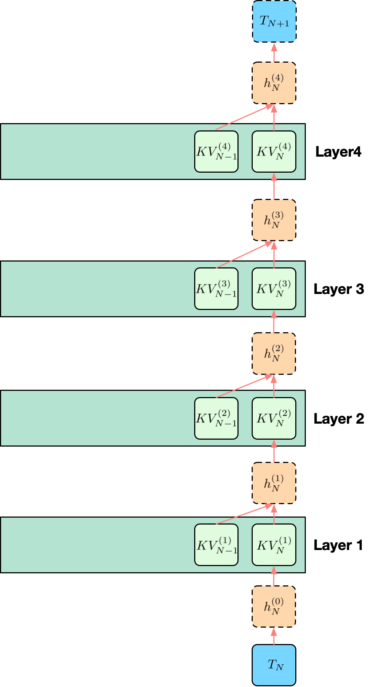
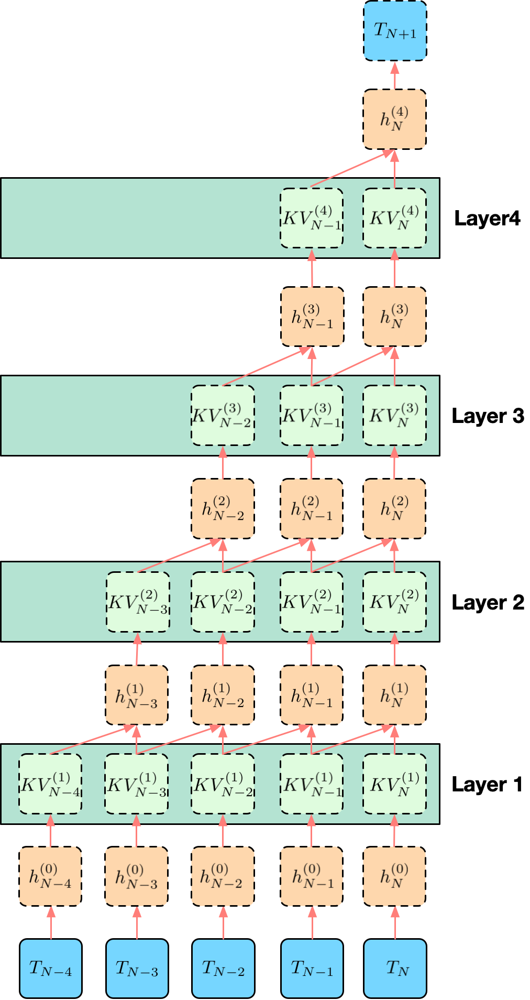
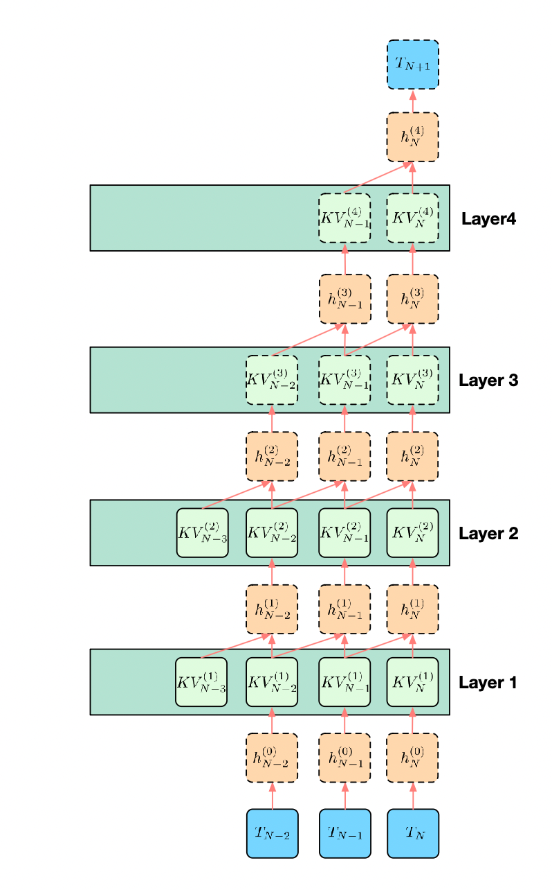
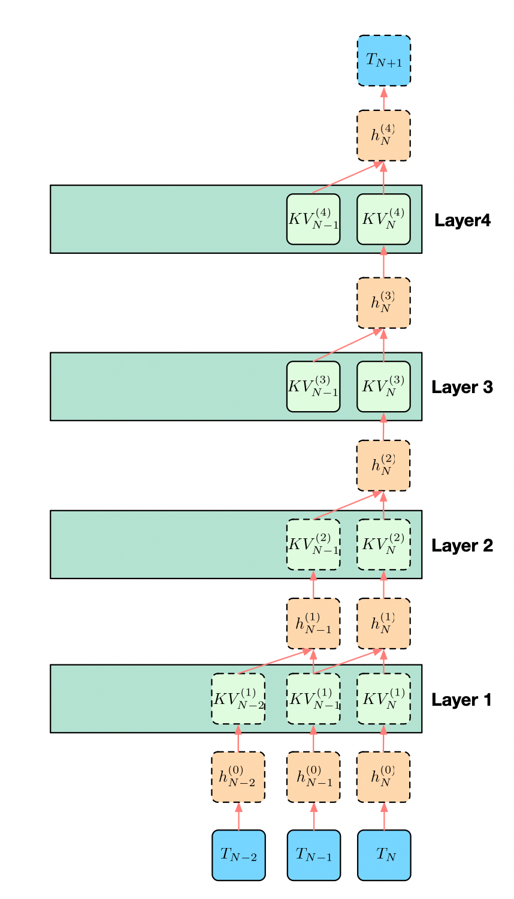
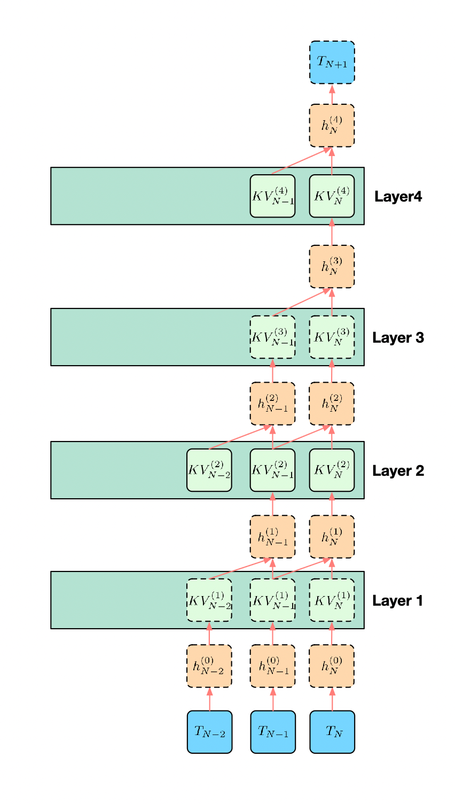

# DeepSeek KV Cache 存储方案

## 1. 问题定义

设已命中的前缀长度为 $N$，现在模型要根据前缀最后一个位置预测下一个 token，即 $token_{N+1}$。模型共有 $L$ 层，并采用 sliding window attention（SWA）。这里约定窗口大小 $W$ 包含当前参与计算的位置本身。因此在位置 $N$ 计算用于预测 $token_{N+1}$ 的表示时，第 $\ell$ 层访问的窗口范围为

$$
\mathcal{W}_N = \{N-W+1,\dots,N\}
$$

若 $N < W$，则窗口退化为 $\{1,\dots,N\}$。记：

- 第 $\ell$ 层、位置 $t$ 的输出 hidden state 为 $h_t^{(\ell)}$，其中 $h_t^{(0)}$ 表示输入 token embedding
- 第 $\ell$ 层、位置 $t$ 的 key/value 状态记为 $KV_t^{(\ell)}$，其中包含 $K_t^{(\ell)}$ 和 $V_t^{(\ell)}$

位置 $N$ 的最后一层输出表示为 $h_N^{(L)}$，它经过 LM head 后用于预测 $token_{N+1}$。为了得到 $h_N^{(L)}$，模型需要从第 1 层计算到第 $L$ 层。对任意一层 $\ell$，位置 $N$ 的计算需要两类信息：

1. **当前 token 在这一层的输入**，即 $h_N^{(\ell-1)}$

2. **SWA 窗口内的历史 attention 状态**，即 $\{KV_t^{(\ell)}\}_{t \in \mathcal{W}_N}$

下面将以一个 $L=4$, $W=2$ 的例子来说明各个方案的存储与计算。

## 2. 完全保存 SWA KV Cache Baseline

最直接的做法是：对每一层 $\ell = 1,\dots,L$，保存所有可能进入 SWA 窗口的 full K/V。预测 $token_{N+1}$ 时的执行路径为：

1. 从底向上计算位置 $N$ 的表示，得到 $h_N^{(0)}, h_N^{(1)}, \dots$
2. 到达第 $\ell$ 层时，用 $h_N^{(\ell-1)}$ 生成当前位置的 query
3. 读取第 $\ell$ 层窗口内缓存的 full K/V：$\{KV_t^{(\ell)}\}_{t \in \mathcal{W}_N}$
4. 完成该层 attention 和后续子层，得到 $h_N^{(\ell)}$
5. 重复直到第 $L$ 层，得到 $h_N^{(L)}$

### 示例

  

图中的例子取 $L=4, W=2$，因此位置 $N$ 在每一层只访问窗口 $\mathcal{W}_N=\{N-1,N\}$。绿色块表示已经保存好的 full KV，橙色块表示当前位置 $N$ 沿层向上计算得到的 hidden state。虚线框表示当前 decode step 需要计算的，实线框表示已经缓存并可直接读取的。

以第 4 层为例，$h_N^{(4)}$ 的计算读取 $KV_{N-1}^{(4)}$ 和 $KV_N^{(4)}$。系统不需要重新计算 $h_{N-1}^{(3)}$，因为位置 $N-1$ 在第 4 层需要贡献给 attention 的状态已经保存在 $KV_{N-1}^{(4)}$ 中。其它层同理：当前位置的 hidden state 逐层向上计算，窗口内历史 token 的影响通过各层已缓存的 full KV 进入 attention。

### 开销

#### DRAM 存储开销
若前缀命中长度为 $N$，full KV baseline 需要为命中前缀保存完整 K/V。其状态规模近似为：

$$
B_{\text{full}}(N) \approx N \cdot L \cdot 2 \cdot H_{kv} \cdot D \cdot s
$$

其中 $H_{kv}$ 为每层 KV 头数，$D$ 为 head dim，$s$ 为每个元素字节数。公式中的系数 $2$ 来自 K 和 V 两个张量。

#### HBM 搬运开销

SWA 只限制当前 step 的 attention 读取范围；若只看第 $N$ 个位置实际参与 attention 的窗口工作集，规模为：

$$
B_{\text{swa}}(W) \approx W \cdot L \cdot 2 \cdot H_{kv} \cdot D \cdot s
$$

如果命中后的 full KV 已经在 GPU KV cache 中，当前 step 的主要数据读取就是窗口内的 $B_{\text{swa}}(W)$。

#### 计算开销

窗口内 $KV_t^{(\ell)}$ 已经是 attention 可消费的终态，当前 step 不需要恢复历史 KV。因此，full KV baseline 的额外恢复计算可以近似看作 0。

但 baseline 仍然要完成当前位置 $N$ 的正常 decode 计算。按 token-layer 计数，当前位置 hidden state 需要逐层向上计算：

$$
N_{\text{hidden}}^{\text{full}}
= L
$$

attention 侧，每一层读取窗口内 $W$ 个位置的 KV，因此逻辑 attention 访问规模为：

$$
N_{\text{attn-read}}^{\text{full}}
\approx L \cdot W
$$

以 DeepSeek V4 Pro 的量级估算，若取 $L=61,W=128$，full KV baseline 在一次 decode step 中的计数为：

$$
N_{\text{hidden}}^{\text{full}} = 61
$$

$$
N_{\text{attn-read}}^{\text{full}}
\approx 61 \times 128
= 7808
$$

## 3. 完全重算 Baseline

另一个极端方案是只保留前缀内容本身，不为命中前缀长期保存可直接使用的 K/V。prefix hit 表示系统知道这段 token 序列已经出现过；当前 step 需要窗口 $\mathcal{W}_N$ 的 K/V 时，系统从 token 和已有边界状态重新生成这些状态。

预测 $token_{N+1}$ 时，每一层最终仍然只需要窗口内状态：

$$
\{KV_t^{(\ell)}\}_{t \in \mathcal{W}_N}
$$

为了得到第 $\ell$ 层、窗口内位置 $t$ 的 $KV_t^{(\ell)}$，系统需要先得到该位置上一层的 hidden state $h_t^{(\ell-1)}$。而 $h_t^{(\ell-1)}$ 又依赖更低层对位置 $t$ 的 SWA 窗口计算。完全重算因此会形成一个向低层、向更早 token 扩张的依赖锥。

### 示例

  

仍取 $L=4, W=2$。为了计算 $h_N^{(4)}$，第 4 层需要第 3 层窗口内的 hidden states，即位置 $\{N-1,N\}$。继续向低层展开。这正对应图里的依赖锥：虽然每一层 SWA 只看 2 个位置，但为了从零恢复最高层当前位置的输出，底部输入范围会扩展到 5 个 token。

### 开销

#### DRAM 存储开销

完全重算 baseline 不长期保存可直接读取的 full KV。若只保留原始 token 和最小 metadata，KV 存储可以近似看作 0。这个方案把 DRAM/cache tier 的 KV 存储压力压到最低。

#### HBM 搬运开销

prefix hit 后不需要搬运 full KV。系统需要把原始 token、必要 metadata 和重算所需的中间结果送入当前计算路径。相比 full KV baseline，它减少了 KV load，但无法避免后续重算产生的 HBM 读写。

#### 计算开销

可以用一个递推集合描述这个依赖锥。令 $R_\ell$ 表示重算过程中需要得到第 $\ell$ 层 hidden state 的位置集合。为了得到最终输出，最高层只需要当前位置：

$$
R_L = \{N\}
$$

若第 $\ell$ 层需要计算集合 $R_\ell$ 中的位置，那么第 $\ell-1$ 层必须提供这些位置各自 SWA 窗口内的 hidden states：

$$
R_{\ell-1}
= \bigcup_{t \in R_\ell} \{t-W+1,\dots,t\}
$$

当这些集合都是连续区间时，集合长度会逐层向低层扩张。忽略序列起点截断时，有：

$$
|R_\ell| \approx 1 + (L-\ell)(W-1)
$$

因此，完全重算需要处理的 token-layer 单元数近似为：

$$
N_{\text{hidden}}
\approx
\sum_{\ell=1}^{L} |R_\ell|
\approx
L + \frac{L(L-1)}{2}(W-1)
$$

这里统计的是需要重算的 hidden states，不包含输入 token 覆盖范围。若把输入 token 也算进去，覆盖长度近似为：

$$
|R_0| \approx 1 + L(W-1)
$$

需要恢复的 KV 由对应位置的 hidden states 派生得到，下面不再单独统计这部分 token-layer 数。

以 DeepSeek V4 Pro 的量级做一个估算，若取 $L=61$、$W=128$，则输入 token 覆盖范围约为：

$$
1 + L(W-1)
= 1 + 61 \times 127
= 7748
$$

也就是说，在没有中间 checkpoint 截断依赖的情况下，单次恢复可能向前扩展到约 $7.7K$ 个输入 token 的范围。累计 hidden-state 重算量为：

$$
L + \frac{L(L-1)}{2}(W-1)
= 61 + \frac{61 \times 60}{2} \times 127
= 232471
$$

## 4. 保存浅层 KV 的恢复成本

另一种做法是只长期保存浅层 full KV。设保存的层为 $1,\dots,m$，未保存的层为 $m+1,\dots,L$。预测 $token_{N+1}$ 时，浅层 KV 可以直接服务这些层的 SWA attention；高层 KV 缺失，需要在当前 step 从浅层输出继续恢复。

执行路径可以写成：

1. 为高层缺失段确定需要恢复的窗口位置集合
2. 将这些位置从输入侧推到第 $m$ 层，得到 $\{h_t^{(m)}\}_{t\in R_m}$
3. 用这些第 $m$ 层 hidden states 继续恢复第 $m+1,\dots,L$ 层的窗口状态
4. 逐层得到最终的 $h_N^{(L)}$，并预测 $token_{N+1}$

这个路径的特点是：浅层 KV 已经保存，但系统仍然要把多个 token 位置推过浅层，给高层窗口状态恢复提供输入。

### 示例

  

图中例子取 $L=4, W=2, m=2$。第 1、2 层的 KV 已经保存，第 3、4 层的 KV 需要恢复。为了得到最终的 $h_N^{(4)}$，第 4 层需要窗口内 $KV_{N-1}^{(4)},KV_N^{(4)}$；这些 KV 又需要第 3 层对应位置的 hidden states。因此第 3 层要恢复位置 $\{N-1,N\}$，第 2 层需要提供位置 $\{N-2,N-1,N\}$ 的 hidden states。浅层 KV 虽然已经保存，但系统仍然要把这 3 个位置从输入侧推到第 2 层，形成一个浅层矩形带。

在 $L=4,W=2,m=2$ 的例子里，未保存高层数为 $q=L-m=2$。第 2 层需要提供的位置数为：

$$
|R_2| = 1 + 2 \times 1 = 3
$$

浅层矩形带需要计算 $2 \times 3=6$ 个 hidden-state 单元；高层依赖锥需要计算 $|R_3|+|R_4|=2+1=3$ 个 hidden-state 单元。这与图中的形状一致：第 1、2 层是宽度为 3 的矩形带，第 3、4 层继续向上收缩。

### 开销

#### DRAM 存储开销

保存浅层 $1,\dots,m$ 的 full KV 时，前缀长度为 $N$ 的常驻状态规模近似为：

$$
B_{\text{shallow}}(N,m)
\approx
N \cdot m \cdot 2 \cdot H_{kv} \cdot D \cdot s
$$

它是 full KV baseline 的 $m/L$。存储量下降来自不保存高层 KV；代价是高层窗口状态要在命中后恢复。

#### HBM 搬运开销

浅层 KV 已经保存，恢复 $R_m$ 中多个位置时，每个浅层 token-layer 单元都要读取对应层的 SWA 窗口 KV。若按逻辑 attention 读取量估算，浅层读取规模近似为：

$$
B_{\text{low-read}}
\approx
m \cdot |R_m| \cdot W \cdot 2 \cdot H_{kv} \cdot D \cdot s
$$

相邻窗口之间存在重叠，实际 kernel 的 HBM 访问会受 layout、cache 命中和 batching 影响。这个式子更适合作为上界口径，表示浅层矩形带会把同一批浅层 KV 反复用于多个位置的恢复计算。

#### 计算开销

保存浅层 KV 的主要计算压力来自两部分：一是浅层矩形带，需要把 $|R_m|$ 个位置逐层推到分界层 $m$；二是高层缺失段，需要生成窗口内高层 KV 并继续向上恢复。和保存高层 KV 相比，这条路线没有直接保存当前 step 最靠近输出侧的 attention 状态，因此仍然需要把多个 token 的 hidden states 推过未保存的高层。

令 $R_\ell$ 表示为了恢复最终输出，需要得到第 $\ell$ 层 hidden state 的位置集合。高层缺失段满足：

$$
R_L=\{N\}
$$

$$
R_{\ell-1}
= \bigcup_{t \in R_\ell} \{t-W+1,\dots,t\},
\quad \ell=m+1,\dots,L
$$

忽略序列起点截断时，分界层需要提供的位置数为：

$$
|R_m| \approx 1 + (L-m)(W-1)
$$

这就是浅层矩形带的宽度。保存浅层 KV 后，低层不再产生继续向更早 token 扩张的依赖锥；但为了给高层恢复提供输入，系统需要为 $R_m$ 中每个位置计算 $h_t^{(1)},\dots,h_t^{(m)}$。因此，浅层 hidden-state 计算量近似为：

$$
N_{\text{low-hidden}}
\approx
m \cdot |R_m|
\approx
m \cdot \bigl(1 + (L-m)(W-1)\bigr)
$$

高层缺失段继续形成一个依赖锥。令 $q=L-m$，则高层 hidden-state 重算量近似为：

$$
N_{\text{high-hidden}}
\approx
\sum_{\ell=m+1}^{L} |R_\ell|
\approx
q + \frac{q(q-1)}{2}(W-1)
$$

合起来，保存浅层 KV 时的 hidden-state 计算单元数近似为：

$$
N_{\text{hidden}}^{\text{shallow}}
\approx
m \cdot \bigl(1 + q(W-1)\bigr)
+ q + \frac{q(q-1)}{2}(W-1)
$$

其中 $q=L-m$。这个式子对应“浅层矩形带 + 高层依赖锥”：第一项是把多个位置推过已缓存 KV 的浅层，第二项是高层缺失段内部的重算。

以 DeepSeek V4 Pro 的量级估算，若取 $L=61,W=128$，并保存前 $31$ 层浅层 KV，则 $m=31,q=30$。分界层需要提供的位置数为：

$$
|R_m|
\approx
1 + 30 \times 127
= 3811
$$

浅层矩形带的 hidden-state 计算量为：

$$
31 \times 3811
= 118141
$$

高层依赖锥的 hidden-state 计算量为：

$$
30 + \frac{30 \times 29}{2}\times 127
= 55275
$$

因此，总 hidden-state 计算量约为：

$$
N_{\text{hidden}}^{\text{shallow}}
\approx
118141 + 55275
= 173416
$$

这个数说明，保存前 31 层虽然降低了常驻 KV 存储，但高层缺失段会迫使系统把宽度为 $3811$ 的位置集合推过浅层，矩形带成为主要计算项。

这个模型也解释了“保存前一半层”和“保存后一半层”的不对称。保存浅层时，系统省掉的是低层 KV 的长期存储和低层依赖扩张，但当前 step 仍要承担一个宽度为 $|R_m|$ 的浅层矩形带，以及高层缺失段的依赖锥。保存高层时，靠近输出侧的窗口 KV 已经存在，恢复路径更容易退化为当前位置的竖线加较低层的局部恢复。

## 5. 保存深层 KV 的恢复成本

保存深层 KV 是另一种连续层 checkpoint。设低层 $1,\dots,m$ 不保存 full KV，深层 $m+1,\dots,L$ 长期保存 full KV。预测 $token_{N+1}$ 时，高层 attention 需要的窗口 KV 已经存在；系统主要需要恢复当前位置 $N$ 在第 $m$ 层的 hidden state，然后沿深层一路向上计算当前位置的输出。

执行路径可以写成：

1. 从输入侧恢复当前位置 $N$ 在第 $m$ 层的 hidden state
2. 对低层缺失段 $1,\dots,m$，按 SWA 依赖向更早 token 展开
3. 到达第 $m$ 层后，进入已经保存 KV 的深层
4. 在第 $m+1,\dots,L$ 层沿当前位置 $N$ 向上计算，并读取深层窗口 KV

这个路径的特点是：恢复扩张集中在低层；到达分界层后，高层窗口 KV 已经可读，后续主要是一条当前位置竖线。

### 示例

  

图中例子取 $L=4,W=2,m=2$。第 3、4 层的 KV 已经保存，第 1、2 层的 KV 需要恢复。为了得到 $h_N^{(4)}$，第 4 层可以直接读取 $KV_{N-1}^{(4)},KV_N^{(4)}$；第 3 层也可以直接读取 $KV_{N-1}^{(3)},KV_N^{(3)}$。因此，高层只需要沿当前位置 $N$ 形成一条竖线：$h_N^{(2)} \rightarrow h_N^{(3)} \rightarrow h_N^{(4)}$。

剩下的问题是如何得到 $h_N^{(2)}$。由于第 1、2 层 KV 没有保存，低层需要从输入侧恢复一个依赖锥。为了计算 $h_N^{(2)}$，第 2 层需要窗口内 $KV_{N-1}^{(2)},KV_N^{(2)}$；这些 KV 来自第 1 层的 hidden states。继续向下展开，第 1 层需要覆盖 $\{N-2,N-1,N\}$ 的输入 token。于是计算形状变成“低层依赖锥 + 高层竖线”。

在 $L=4,W=2,m=2$ 的例子里，低层 hidden-state 计算量为：

$$
2 + \frac{2 \times 1}{2}\times 1 = 3
$$

深层竖线还需要 $q=2$ 个 hidden-state 单元，因此总 hidden-state 计算量为 $5$。这与图中的形状一致：底部需要覆盖 3 个输入 token，低层形成一个小依赖锥；到达第 2 层后，高层 KV 已经可读，后续只沿当前位置向上计算。

### 开销

#### DRAM 存储开销

保存深层 $m+1,\dots,L$ 的 full KV 时，前缀长度为 $N$ 的常驻状态规模近似为：

$$
B_{\text{deep}}(N,m)
\approx
N \cdot (L-m) \cdot 2 \cdot H_{kv} \cdot D \cdot s
$$

它是 full KV baseline 的 $(L-m)/L$。若和保存浅层方案使用同样的层数，DRAM 存储量相近；差异主要体现在命中后的恢复计算路径。

#### HBM 搬运开销

深层 KV 已经保存，当前 step 在深层每一层读取窗口内 KV。逻辑读取量近似为：

$$
B_{\text{deep-read}}
\approx
(L-m) \cdot W \cdot 2 \cdot H_{kv} \cdot D \cdot s
$$

低层缺失 KV 在恢复路径中生成和消费。与保存浅层相比，深层保存减少了高层多位置恢复时对 KV 的重复读取；高层只需要服务当前位置 $N$ 的竖线计算。

#### 计算开销

保存深层 KV 的恢复计算集中在低层依赖锥。低层缺失段高度为 $m$，因此重算扩张只发生在底部 $m$ 层；到达分界层后，深层窗口 KV 已经是可直接消费的 attention 状态。这个结构解释了保存深层 KV 往往比保存浅层 KV 更有利于 decode：同样保存一半层时，保存深层直接保住了靠近输出侧的窗口状态，避免在高层为多个历史位置重新生成 hidden states 和 KV。

令 $R_\ell$ 表示为了得到 $h_N^{(m)}$，需要计算第 $\ell$ 层 hidden state 的位置集合。分界层只需要当前位置：

$$
R_m=\{N\}
$$

对缺失 KV 的低层，有：

$$
R_{\ell-1}
= \bigcup_{t \in R_\ell} \{t-W+1,\dots,t\},
\quad \ell=1,\dots,m
$$

忽略序列起点截断时：

$$
|R_\ell| \approx 1 + (m-\ell)(W-1),
\quad \ell=1,\dots,m
$$

因此，低层依赖锥需要计算的 hidden-state 单元数为：

$$
N_{\text{low-hidden}}^{\text{deep}}
\approx
\sum_{\ell=1}^{m} |R_\ell|
\approx
m + \frac{m(m-1)}{2}(W-1)
$$

深层 KV 已经保存，但当前位置仍然要逐层向上计算 hidden state。令 $q=L-m$，深层竖线的 hidden-state 单元数为：

$$
N_{\text{high-line}}^{\text{deep}} = q
$$

合起来，保存深层 KV 时的 hidden-state 计算单元数近似为：

$$
N_{\text{hidden}}^{\text{deep}}
\approx
m + \frac{m(m-1)}{2}(W-1) + q
=
L + \frac{m(m-1)}{2}(W-1)
$$

以 DeepSeek V4 Pro 的量级估算，若取 $L=61,W=128$，并保存后 $31$ 层深层 KV，则缺失低层数为 $m=30$，深层竖线长度为 $q=31$。低层依赖锥的 hidden-state 计算量为：

$$
30 + \frac{30 \times 29}{2}\times 127
= 55275
$$

深层竖线还需要：

$$
q = 31
$$

因此，总 hidden-state 计算量约为：

$$
N_{\text{hidden}}^{\text{deep}}
\approx
55275 + 31
= 55306
$$

在保存层数几乎相同的情况下，保存后 31 层的恢复计算远低于保存前 31 层。差异来自保存位置：深层 KV 已经覆盖了靠近输出侧的窗口状态，当前 step 只需要先恢复低层依赖锥，再沿深层当前位置向上计算。

## 6. 间隔层保存 KV 的恢复成本

另一种层维 checkpoint 是间隔保存 full KV。设层间隔为 $S$，保存层集合为：

$$
\mathcal{C}_{\text{layer}} = \{S,2S,\dots,L\}
$$

这里先假设 $L$ 可以被 $S$ 整除。若最后一段不足 $S$ 层，可以按实际段长替换下面公式中的 $S$。这种方案在层深方向上周期性放置恢复边界，并未把某一段连续层全部保留下来。

执行路径可以写成：

1. 从顶层当前位置开始，确定当前分段需要的 hidden-state 位置集合
2. 在两个相邻保存层之间恢复未保存层的局部状态
3. 到达下一个保存层后，利用该层已保存的窗口 KV 继续向下一个分段传递
4. 分段重复，直到恢复出最终需要的 $h_N^{(L)}$

这个路径的特点是：完整依赖锥被多个保存层切成若干梯形段。每段都有一个已有宽度的输入集合，同时段内未保存层仍会继续向更早 token 扩张。

### 示例

  

图中例子取 $L=4,W=2,S=2$，保存的是 Layer2 和 Layer4 的 KV。Layer1 和 Layer3 的 KV 需要在当前 step 恢复。为了得到 $h_N^{(4)}$，Layer4 可以直接读取已保存的 $KV_{N-1}^{(4)},KV_N^{(4)}$，但仍然需要输入 $h_N^{(3)}$。为了得到 $h_N^{(3)}$，Layer3 需要恢复窗口内 $KV_{N-1}^{(3)},KV_N^{(3)}$，因此需要下方 Layer2 提供 $h_{N-1}^{(2)},h_N^{(2)}$。这两个 hidden states 再由 Layer2 借助已保存的 KV 计算出来。

图中每个保存层提供一个横向边界，阻止依赖锥继续无界向下扩张；但在两个保存层之间，未保存层仍会把所需位置集合向更早 token 扩大。每一段可以看成“已有宽度的矩形带 + 段内小三角”。

在这个例子里，把保存层按从上到下编号，顶段宽度为：

$$
b_0 = 1
$$

经过一个高度为 $S=2$ 的分段后，传递到下一个 checkpoint 的宽度变为：

$$
b_1=2
$$

顶段需要 Layer4 输出 1 个位置，Layer3 计算 1 个位置；底段需要 Layer2 输出 2 个位置，Layer1 计算 2 个位置。图中底部覆盖到 $T_{N-2},T_{N-1},T_N$，正是因为下方分段需要给上方分段提供宽度为 2 的 Layer2 hidden states。

### 开销

#### DRAM 存储开销

间隔保存 full KV 时，常驻层数为 $G=L/S$。前缀长度为 $N$ 时，存储规模近似为：

$$
B_{\text{interval}}(N,S)
\approx
N \cdot \frac{L}{S} \cdot 2 \cdot H_{kv} \cdot D \cdot s
$$

相对于 full KV baseline，它把层维存储比例降到 $1/S$。例如 $S=2$ 时，只保存一半层的 KV。

#### HBM 搬运开销

当前 step 会读取保存层上的窗口 KV。若第 $j$ 个保存层需要计算 $b_j$ 个位置的 hidden output，则逻辑读取量近似为：

$$
B_{\text{saved-read}}
\approx
\left(\sum_{j=0}^{G-1} b_j\right)
\cdot W \cdot 2 \cdot H_{kv} \cdot D \cdot s
$$

未保存层的 K/V 在恢复路径中生成和消费，通常表现为中间结果读写；长期 full KV 的读取只发生在保存层。实际 HBM 压力取决于 kernel 是否能把这些中间状态留在片上，或者是否需要把分段恢复结果写回 HBM 后再被后续层读取。

#### 计算开销

间隔层保存 KV 把完整依赖锥切成多个梯形段。和完全重算相比，最大连续未保存层数从 $L$ 变成 $S-1$，单段扩张受到限制。和只保存浅层相比，它不会在高层留下一个连续很长的缺失段，因此更容易控制当前 step 的恢复深度。

这条路线仍然需要注意一个边界：保存对象是 KV，hidden states 仍需在当前 step 计算。保存层可以直接提供 attention 的历史状态，但它的当前输出 $h_t^{(\ell)}$ 仍然要由输入 $h_t^{(\ell-1)}$ 计算出来。因此，分段之间传递的对象是若干位置的 hidden states，计算形状自然表现为梯形堆叠。

用集合建模。把保存层按从上到下编号，令第 $j$ 个分段的上端保存层需要输出的位置集合宽度为 $b_j$。最顶层只需要当前位置：

$$
b_0 = 1
$$

经过一个高度为 $S$ 的分段后，往下一层 checkpoint 传递的位置宽度增加：

$$
b_{j+1}
\approx
b_j + (S-1)(W-1)
$$

因此：

$$
b_j \approx 1 + j(S-1)(W-1)
$$

这里的 $(S-1)(W-1)$ 来自段内未保存的 $S-1$ 层。保存层自身的 KV 已经存在，它在计算 hidden output 时读取已保存窗口 KV，不再要求下方 hidden states 覆盖整个 attention 窗口。

设分段数为：

$$
G = \frac{L}{S}
$$

第 $j$ 段内部需要计算的 hidden-state 单元数近似为：

$$
C_{\text{seg-hidden}}(b_j)
\approx
S \cdot b_j
+ \frac{(S-1)(S-2)}{2}(W-1)
$$

其中第一项是宽度为 $b_j$ 的矩形带，第二项是段内未保存层继续展开形成的小三角。总 hidden-state 计算量为：

$$
N_{\text{hidden}}^{\text{interval}}
\approx
\sum_{j=0}^{G-1}
\left[
S \cdot b_j
+ \frac{(S-1)(S-2)}{2}(W-1)
\right]
$$

代入 $b_j$ 后得到：

$$
N_{\text{hidden}}^{\text{interval}}
\approx
L
+ \frac{G(S-1)(S-2)}{2}(W-1)
+ \frac{S(S-1)G(G-1)}{2}(W-1)
$$

## 7. 间隔 Token Checkpoint

若 checkpoint 只保存位置 $c$ 的单个 hidden state 或单个 $KV_c^{(\ell)}$，它无法独立恢复后续 token，计算 $c+1$ 时仍然需要每一层窗口内的历史 KV。为了让 checkpoint 成为可继续 decode 的边界，这里采用一个 full-state checkpoint 口径：在 checkpoint 位置 $c$，保存每一层窗口末端的 full KV：

$$
\mathcal{B}_c
=
\left\{
KV_t^{(\ell)}
\mid
\ell=1,\dots,L,\
t \in \{c-W+1,\dots,c\}
\right\}
$$

若 $c<W$，窗口左端按序列起点截断。

假设 `block size = 1`，系统每隔 $M$ 个 token 保存一个边界 checkpoint。预测 $token_{N+1}$ 时的执行路径为：

1. 选择不超过当前位置 $N$ 的最近 checkpoint，记为 $c$
2. 读取 checkpoint 边界状态 $\mathcal{B}_c$
3. 从 $c+1$ 顺序重算到 $N$，恢复从 checkpoint 到当前位置之间的局部状态
4. 使用恢复后的窗口状态完成当前 decode step

### 开销

#### DRAM 存储开销

checkpoint 位置为：

$$
\mathcal{C}=\{M,2M,3M,\dots\}
$$

前缀长度为 $N$ 时，checkpoint 数量约为：

$$
N_{\text{ckpt}} \approx \left\lceil \frac{N}{M} \right\rceil
$$

若 checkpoint 保存 full SWA 边界状态，常驻存储规模近似为：

$$
B_{\text{token-ckpt}}(N,M)
\approx
\left\lceil \frac{N}{M} \right\rceil
\cdot W \cdot L \cdot 2 \cdot H_{kv} \cdot D \cdot s
$$

相对于完整历史 full KV 的 $B_{\text{full}}(N)$，这个比例约为 $W/M$。当 $M>W$ 时，checkpoint 的常驻 KV 小于完整历史 full KV；当 $M$ 接近 $W$ 或更小，checkpoint 窗口之间会出现较多重叠，存储优势会下降。实际系统若对重叠窗口做去重，存储口径会低于这个 full-state 上界。

#### HBM 搬运开销

命中后，系统需要读取最近的边界 checkpoint $\mathcal{B}_c$。因此，单次恢复的 checkpoint 读取量近似为：

$$
B_{\text{token-ckpt-read}}
\approx
W \cdot L \cdot 2 \cdot H_{kv} \cdot D \cdot s
$$

如果 checkpoint 不在 GPU HBM 中，这部分状态还会引入跨层级搬运。恢复区间内生成的中间状态是否写回 HBM，取决于实现是否能把局部 prefill 留在片上或融合到后续计算中。

#### 计算开销

当预测 $token_{N+1}$ 时，系统选择不超过当前位置 $N$ 的最近 checkpoint：

$$
c=\max\{x\in\mathcal{C}\mid x\le N\}
$$

从 $\mathcal{B}_c$ 出发，系统顺序重算 $c+1,\dots,N$。令恢复长度为：

$$
r=N-c
$$

由于 checkpoint 间隔为 $M$，有：

$$
0 \le r < M
$$

若把恢复过程看作一段局部 prefill，hidden-state token-layer 数近似为：

$$
N_{\text{hidden}}^{\text{token-ckpt}}
\approx
L \cdot r
$$

attention 逻辑读取量还要乘上窗口大小 $W$，近似为 $O(LrW)$。这里的 $r$ 由 token checkpoint 间距控制；checkpoint 边界状态已经提供 $c$ 之前的 SWA window KV，因此恢复过程不再从当前位置向左展开完整依赖锥。

